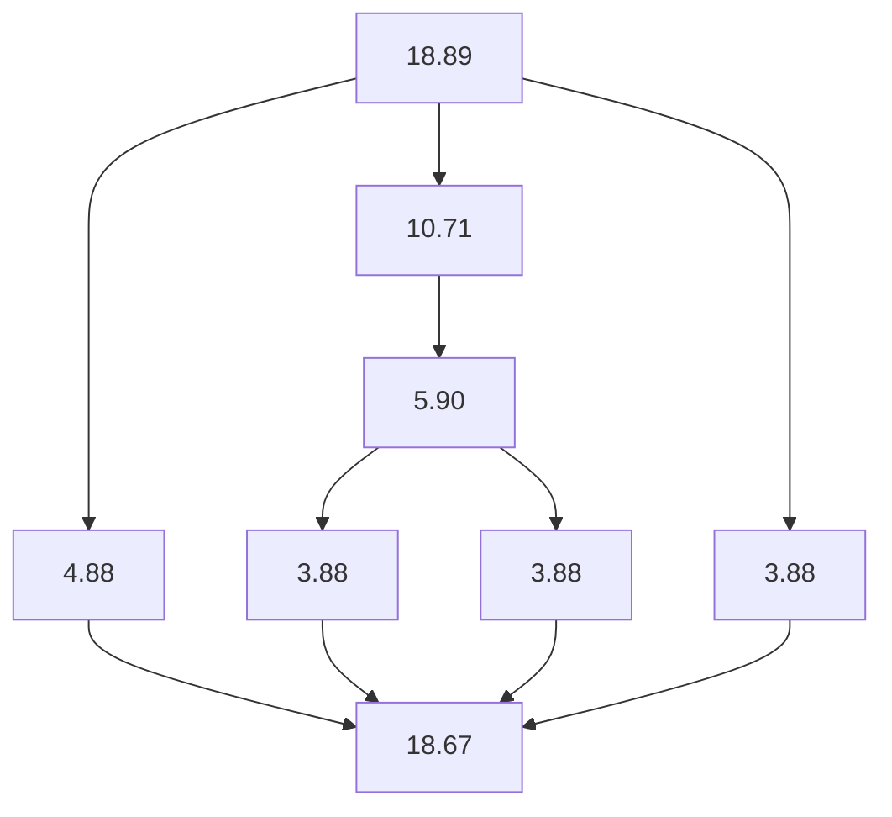
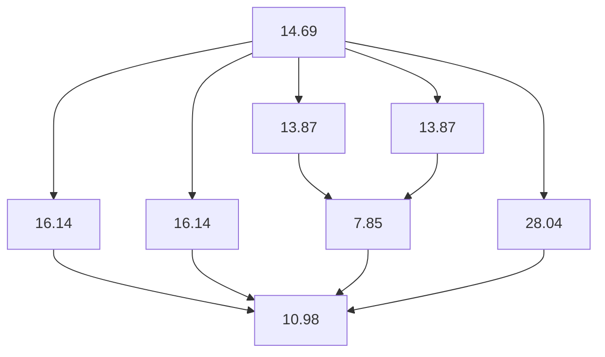
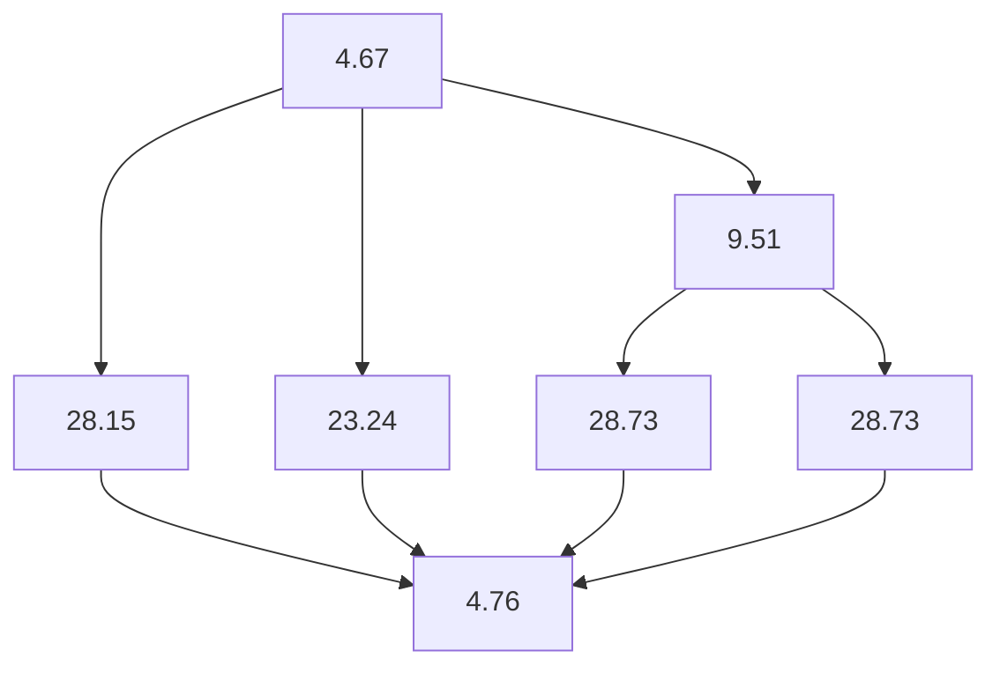
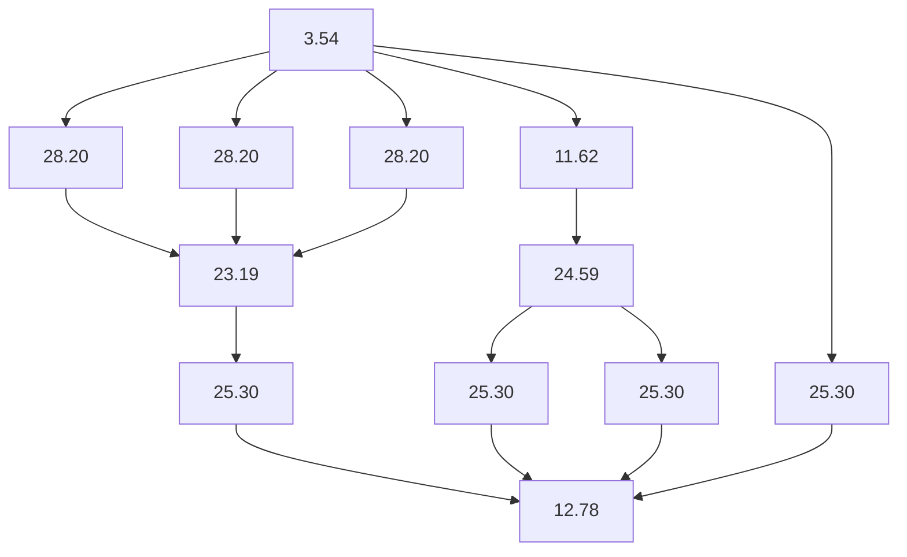
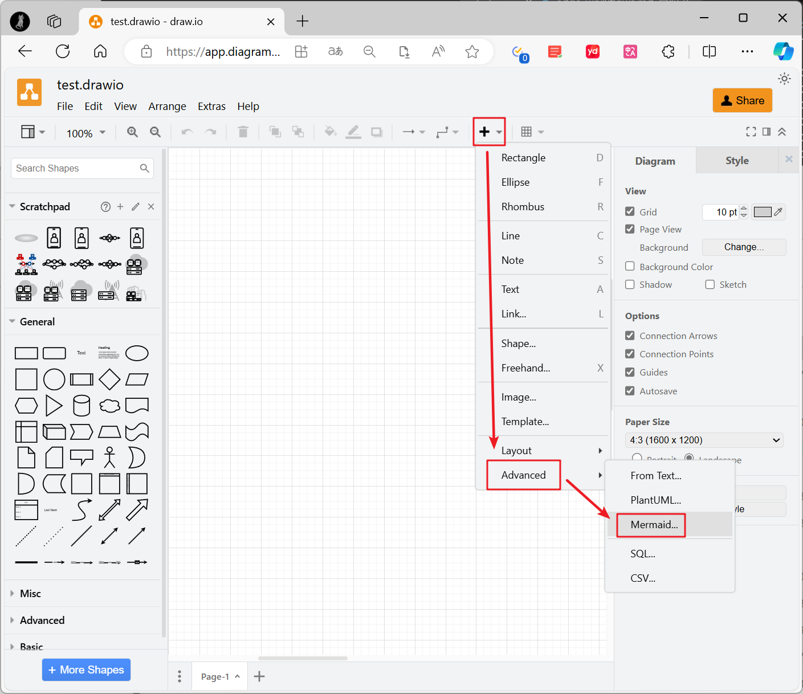
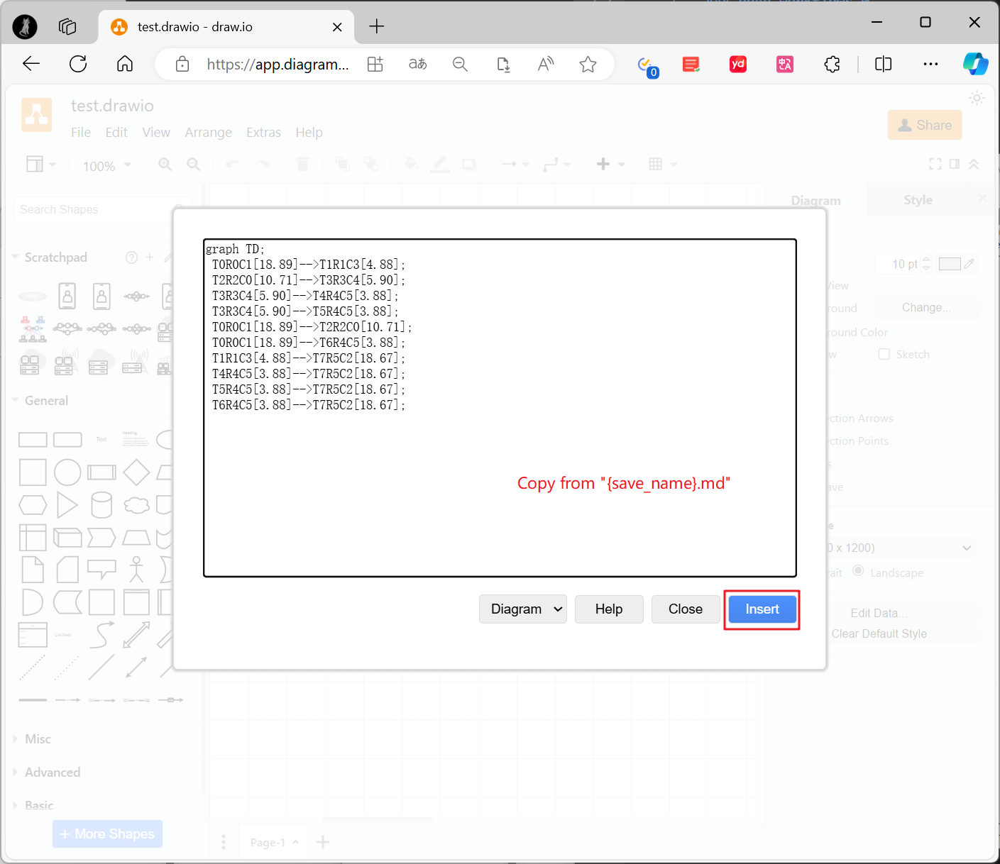
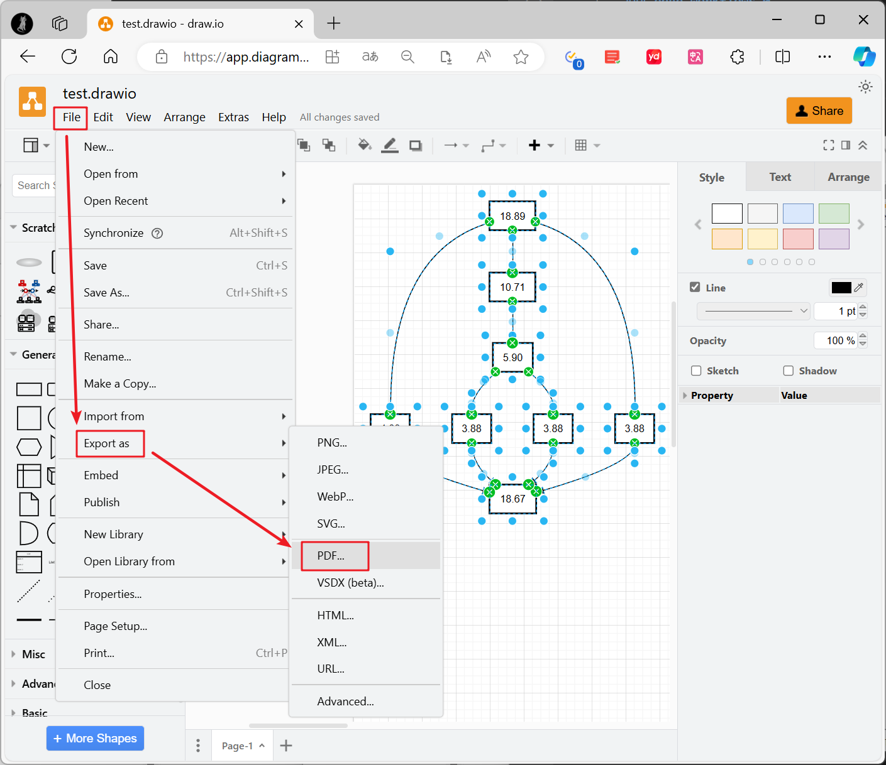

# Labeled Workflow Generator for Heterogeneous Scheduling Research


[](https://www.python.org/)
[](http://badges.mit-license.org)

A single-file random labeled-DAG generator.

**Highlight**
- Simple: pure python, only 2 functions
- Portable: save workflows in mermaid graph, editable in [Drawio](https://draw.io) and  [Excalidraw](https://excalidraw.com/).
- Reasonable: identify task categories according to layer and successors.

**Background Story**
- General-purpose processors (e.g. CPU) can execute all tasks.
- Domain-specific accelerators (e.g. GPU, FPGA, ASIC) can only execute specific categories of tasks.

## Usage

First, copy [random_graph_generator.py](random_graph_generator.py) to your project. Then, depending on your preference:

```python
from random_graph_generator import generate_random_graph, load_workflows

# generate workflows and dump to edge_workflow.md
generate_random_graph(
    save_name="edge_workflows",
    random_seed=1234,
    workflow_numbers=100,
    parallelism=4,
    layer_num_min=5,
    layer_num_max=7,
    connect_prob=0.5,
    min_workload=0.5,
    max_workload=30.0
)

# load workflows from edge_workflow.md
workflows = load_workflows("edge_workflows")
print(workflows[0])
```

The `workflows[0]` should like this:
```
{
    'id': 0,
    'tasks': [
        {'id': 0, 'rank': 0, 'category': 1, 'workload': 18.89},
        {'id': 1, 'rank': 1, 'category': 3, 'workload': 4.88},
        {'id': 2, 'rank': 2, 'category': 0, 'workload': 10.71},
        {'id': 3, 'rank': 3, 'category': 4, 'workload': 5.9},
        {'id': 4, 'rank': 4, 'category': 5, 'workload': 3.88},
        {'id': 5, 'rank': 4, 'category': 5, 'workload': 3.88},
        {'id': 6, 'rank': 4, 'category': 5, 'workload': 3.88},
        {'id': 7, 'rank': 5, 'category': 2, 'workload': 18.67}
    ],
    'dataflows': [
        {'src': 0, 'dst': 1, 'datasize': 11.88},
        {'src': 2, 'dst': 3, 'datasize': 8.3},
        {'src': 3, 'dst': 4, 'datasize': 4.89},
        {'src': 3, 'dst': 5, 'datasize': 4.89},
        {'src': 0, 'dst': 2, 'datasize': 14.8},
        {'src': 0, 'dst': 6, 'datasize': 11.38},
        {'src': 1, 'dst': 7, 'datasize': 11.78},
        {'src': 4, 'dst': 7, 'datasize': 11.28},
        {'src': 5, 'dst': 7, 'datasize': 11.28},
        {'src': 6, 'dst': 7, 'datasize': 11.28}
    ]
}
```


## Examples

Here are some simple examples of generated DAGs:








## Export to PDF


| 1. Open [draw.io](https://draw.io), open Mermaid window | 2. Copy and paste mermaid graph from edge_workflow.md | 3. Export to PDF |
| ------------------------------------------------------- | ----------------------------------------------------- | ---------------- |
|                                               |                                             |        |


## Citation
Please cite our work if you use this software in your work:

**BibTex:**
```bibtex
@misc{LabeledWorkflowGFHS,
  author = {Cheng Qian},
  title = {Labeled Workflow Generator for Heterogeneous Scheduling Research},
  year = {2024},
  howpublished = {\url{https://github.com/pro1515151515/labeled-dag-gen-rnd}},
  note = {Accessed: 2024-07-04}
}
```

**GB/T 7714-2015:**
```
Qian C. Labeled workflow generator for heterogeneous scheduling research[CP/OL]. [2024-07-04]. https://github.com/pro1515151515/labeled-dag-gen-rnd.
```

## Related Repository
- [automaticdai/dag-gen-rnd](https://github.com/automaticdai/dag-gen-rnd/tree/master)


## License
This software is licensed under MIT. See [LICENSE](LICENSE) for details.