### edge_workflows_0
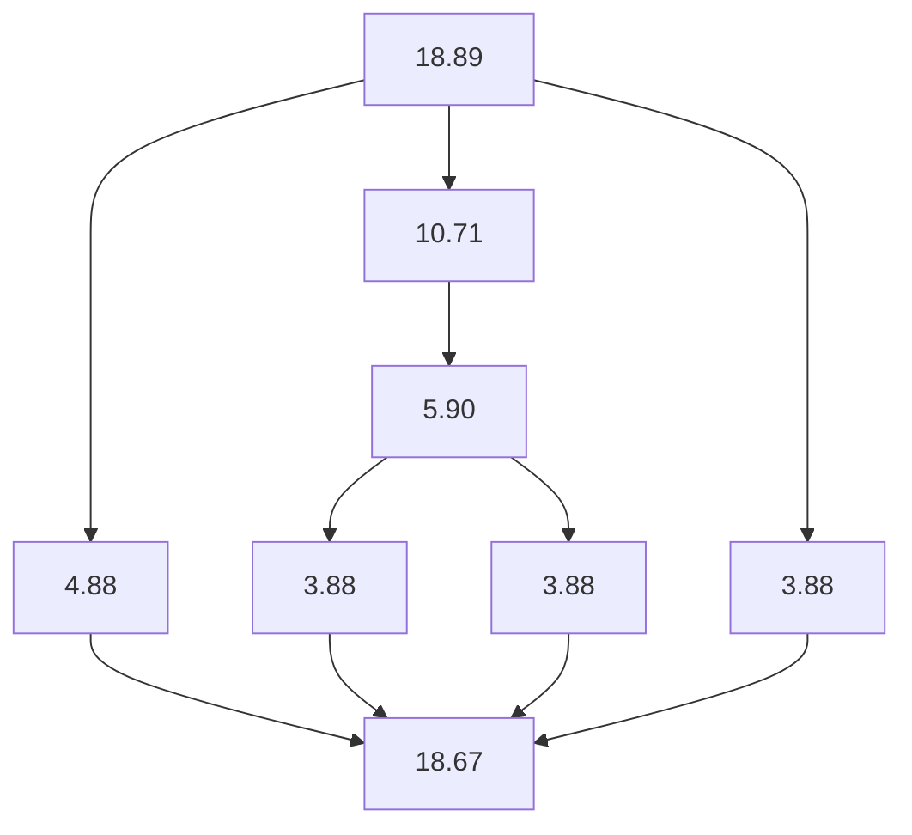
```mermaid
graph TD;
 T0R0C1[18.89]-->T1R1C3[4.88];
 T2R2C0[10.71]-->T3R3C4[5.90];
 T3R3C4[5.90]-->T4R4C5[3.88];
 T3R3C4[5.90]-->T5R4C5[3.88];
 T0R0C1[18.89]-->T2R2C0[10.71];
 T0R0C1[18.89]-->T6R4C5[3.88];
 T1R1C3[4.88]-->T7R5C2[18.67];
 T4R4C5[3.88]-->T7R5C2[18.67];
 T5R4C5[3.88]-->T7R5C2[18.67];
 T6R4C5[3.88]-->T7R5C2[18.67];
```

### edge_workflows_1
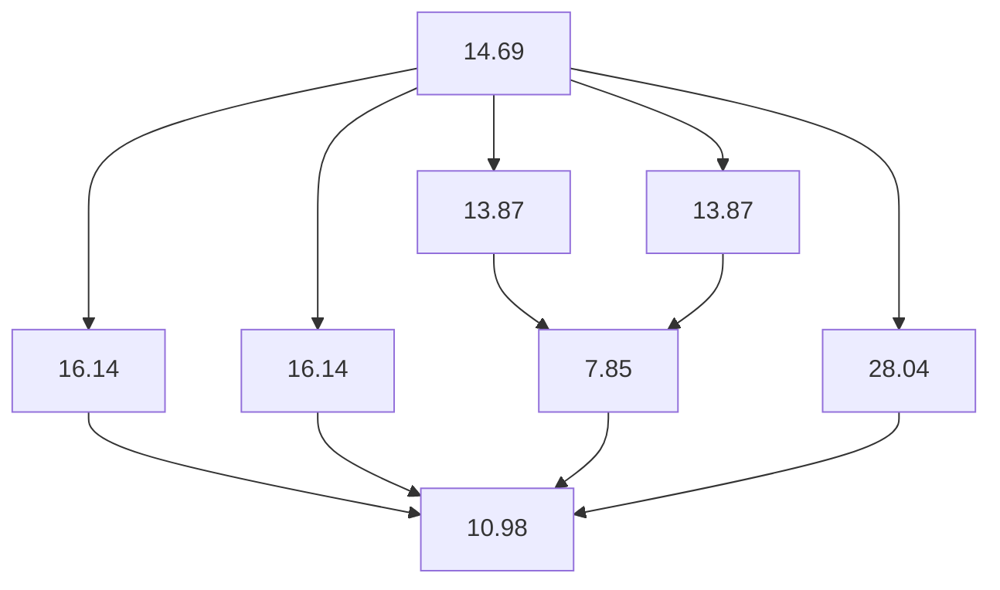
```mermaid
graph TD;
 T0R0C0[14.69]-->T2R1C4[13.87];
 T2R1C4[13.87]-->T5R2C2[7.85];
 T4R1C4[13.87]-->T5R2C2[7.85];
 T0R0C0[14.69]-->T1R1C5[16.14];
 T0R0C0[14.69]-->T3R1C5[16.14];
 T0R0C0[14.69]-->T4R1C4[13.87];
 T0R0C0[14.69]-->T6R3C3[28.04];
 T1R1C5[16.14]-->T7R4C1[10.98];
 T3R1C5[16.14]-->T7R4C1[10.98];
 T5R2C2[7.85]-->T7R4C1[10.98];
 T6R3C3[28.04]-->T7R4C1[10.98];
```

### edge_workflows_2
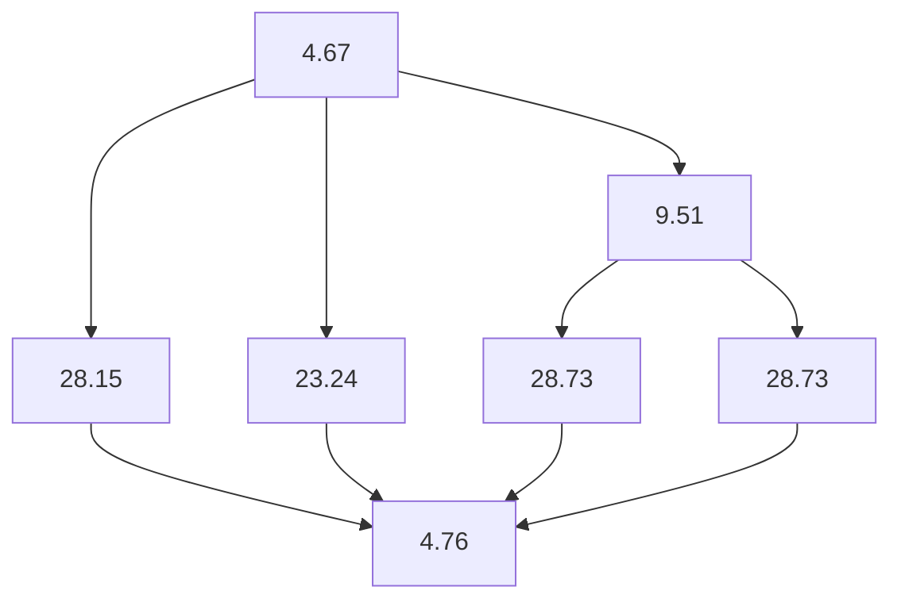
```mermaid
graph TD;
 T0R0C4[4.67]-->T1R1C1[28.15];
 T2R2C5[9.51]-->T4R3C3[28.73];
 T2R2C5[9.51]-->T5R3C3[28.73];
 T0R0C4[4.67]-->T2R2C5[9.51];
 T0R0C4[4.67]-->T3R2C2[23.24];
 T1R1C1[28.15]-->T6R4C0[4.76];
 T3R2C2[23.24]-->T6R4C0[4.76];
 T4R3C3[28.73]-->T6R4C0[4.76];
 T5R3C3[28.73]-->T6R4C0[4.76];
```

### edge_workflows_3
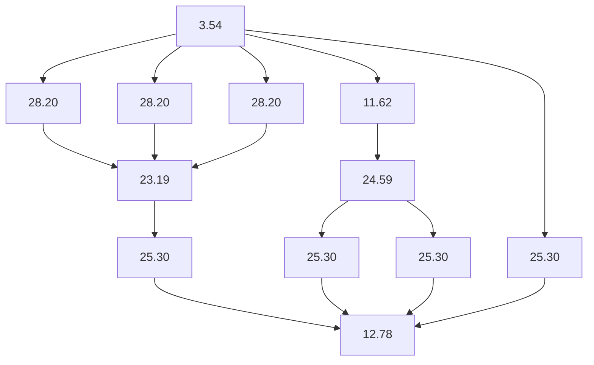
```mermaid
graph TD;
 T0R0C3[3.54]-->T1R1C2[28.20];
 T0R0C3[3.54]-->T3R1C2[28.20];
 T0R0C3[3.54]-->T4R1C2[28.20];
 T2R1C5[11.62]-->T5R2C6[24.59];
 T1R1C2[28.20]-->T6R2C1[23.19];
 T3R1C2[28.20]-->T6R2C1[23.19];
 T4R1C2[28.20]-->T6R2C1[23.19];
 T5R2C6[24.59]-->T8R3C4[25.30];
 T6R2C1[23.19]-->T9R3C4[25.30];
 T5R2C6[24.59]-->T10R3C4[25.30];
 T0R0C3[3.54]-->T2R1C5[11.62];
 T0R0C3[3.54]-->T7R3C4[25.30];
 T8R3C4[25.30]-->T11R4C0[12.78];
 T9R3C4[25.30]-->T11R4C0[12.78];
 T10R3C4[25.30]-->T11R4C0[12.78];
 T7R3C4[25.30]-->T11R4C0[12.78];
```

### edge_workflows_4
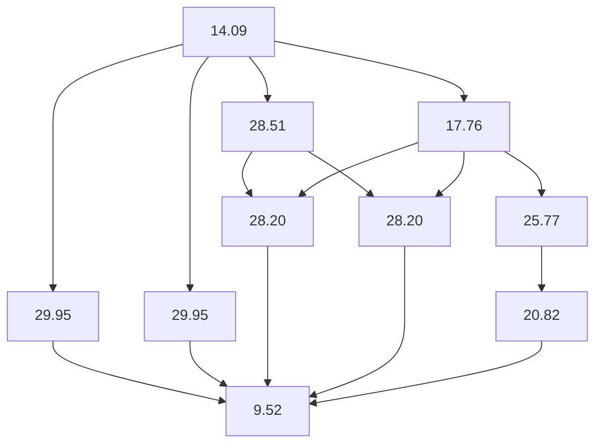
```mermaid
graph TD;
 T0R0C3[14.09]-->T1R1C1[29.95];
 T4R2C4[17.76]-->T5R3C5[25.77];
 T3R2C7[28.51]-->T6R3C0[28.20];
 T4R2C4[17.76]-->T6R3C0[28.20];
 T3R2C7[28.51]-->T7R3C0[28.20];
 T4R2C4[17.76]-->T7R3C0[28.20];
 T5R3C5[25.77]-->T8R4C6[20.82];
 T0R0C3[14.09]-->T2R1C1[29.95];
 T0R0C3[14.09]-->T3R2C7[28.51];
 T0R0C3[14.09]-->T4R2C4[17.76];
 T1R1C1[29.95]-->T9R5C2[9.52];
 T2R1C1[29.95]-->T9R5C2[9.52];
 T6R3C0[28.20]-->T9R5C2[9.52];
 T7R3C0[28.20]-->T9R5C2[9.52];
 T8R4C6[20.82]-->T9R5C2[9.52];
```

### edge_workflows_5
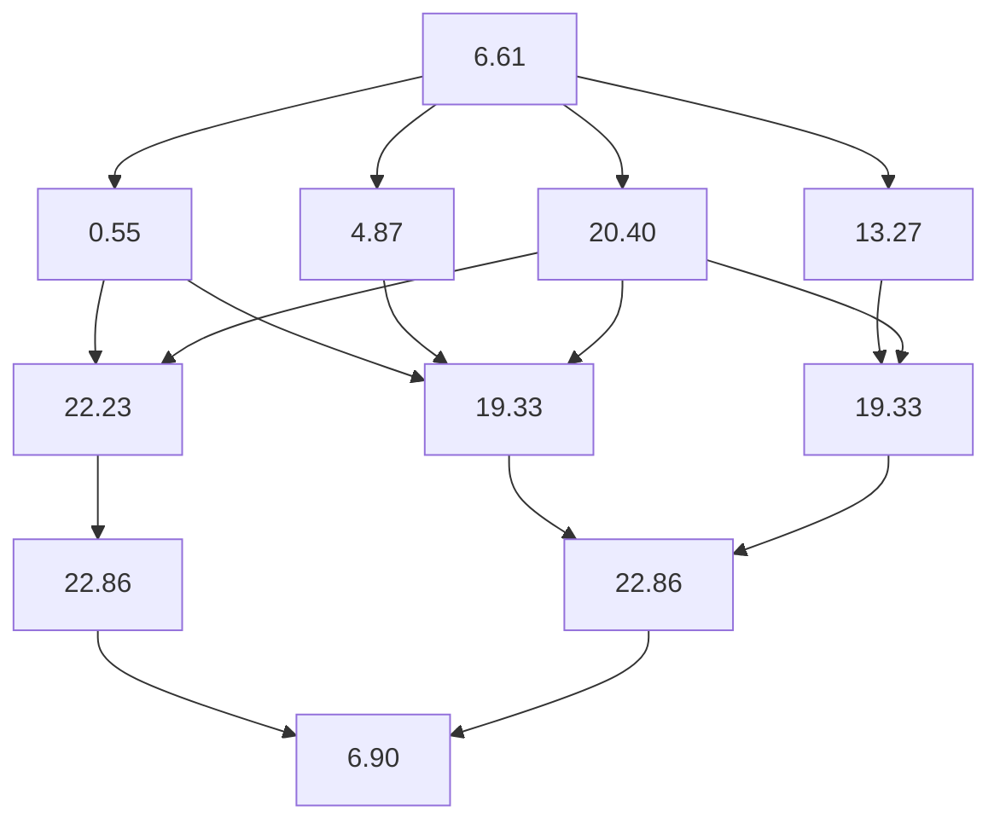
```mermaid
graph TD;
 T0R0C8[6.61]-->T1R1C6[13.27];
 T0R0C8[6.61]-->T3R1C4[4.87];
 T0R0C8[6.61]-->T4R1C1[20.40];
 T2R1C0[0.55]-->T5R2C7[22.23];
 T4R1C1[20.40]-->T5R2C7[22.23];
 T2R1C0[0.55]-->T6R2C2[19.33];
 T3R1C4[4.87]-->T6R2C2[19.33];
 T4R1C1[20.40]-->T6R2C2[19.33];
 T1R1C6[13.27]-->T7R2C2[19.33];
 T4R1C1[20.40]-->T7R2C2[19.33];
 T5R2C7[22.23]-->T8R3C3[22.86];
 T6R2C2[19.33]-->T9R3C3[22.86];
 T7R2C2[19.33]-->T9R3C3[22.86];
 T0R0C8[6.61]-->T2R1C0[0.55];
 T8R3C3[22.86]-->T10R4C5[6.90];
 T9R3C3[22.86]-->T10R4C5[6.90];
```

### edge_workflows_6
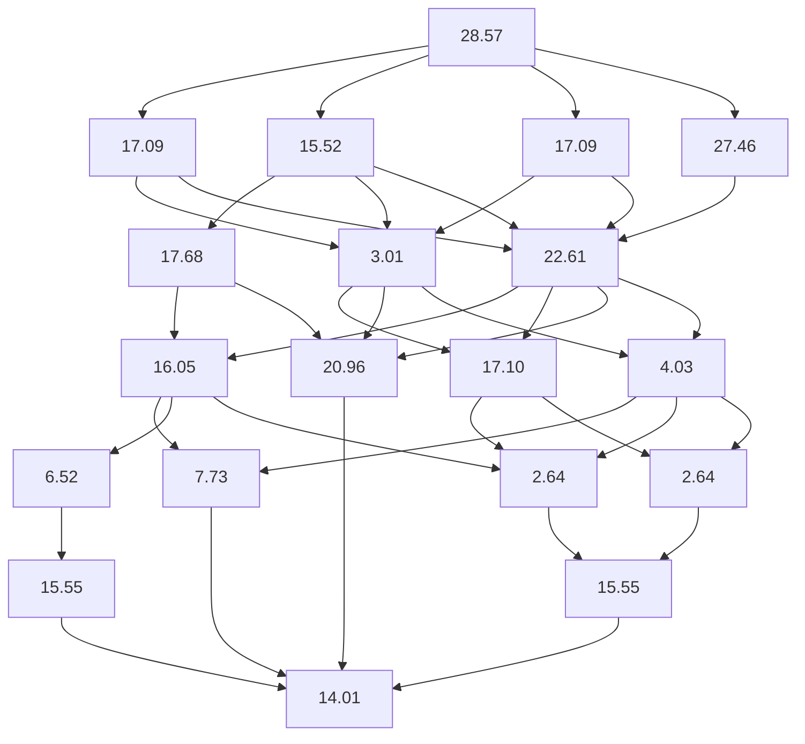
```mermaid
graph TD;
 T0R0C1[28.57]-->T3R1C2[17.09];
 T1R1C3[15.52]-->T5R2C13[17.68];
 T1R1C3[15.52]-->T6R2C11[3.01];
 T2R1C2[17.09]-->T6R2C11[3.01];
 T3R1C2[17.09]-->T6R2C11[3.01];
 T1R1C3[15.52]-->T7R2C4[22.61];
 T2R1C2[17.09]-->T7R2C4[22.61];
 T3R1C2[17.09]-->T7R2C4[22.61];
 T4R1C9[27.46]-->T7R2C4[22.61];
 T5R2C13[17.68]-->T8R3C12[16.05];
 T7R2C4[22.61]-->T8R3C12[16.05];
 T6R2C11[3.01]-->T9R3C0[17.10];
 T7R2C4[22.61]-->T9R3C0[17.10];
 T5R2C13[17.68]-->T10R3C6[20.96];
 T6R2C11[3.01]-->T10R3C6[20.96];
 T7R2C4[22.61]-->T10R3C6[20.96];
 T6R2C11[3.01]-->T11R3C14[4.03];
 T7R2C4[22.61]-->T11R3C14[4.03];
 T8R3C12[16.05]-->T12R4C15[7.73];
 T11R3C14[4.03]-->T12R4C15[7.73];
 T8R3C12[16.05]-->T13R4C7[6.52];
 T8R3C12[16.05]-->T14R4C5[2.64];
 T9R3C0[17.10]-->T14R4C5[2.64];
 T11R3C14[4.03]-->T14R4C5[2.64];
 T9R3C0[17.10]-->T15R4C5[2.64];
 T11R3C14[4.03]-->T15R4C5[2.64];
 T14R4C5[2.64]-->T16R5C8[15.55];
 T15R4C5[2.64]-->T16R5C8[15.55];
 T13R4C7[6.52]-->T17R5C8[15.55];
 T0R0C1[28.57]-->T1R1C3[15.52];
 T0R0C1[28.57]-->T2R1C2[17.09];
 T0R0C1[28.57]-->T4R1C9[27.46];
 T16R5C8[15.55]-->T18R6C10[14.01];
 T17R5C8[15.55]-->T18R6C10[14.01];
 T10R3C6[20.96]-->T18R6C10[14.01];
 T12R4C15[7.73]-->T18R6C10[14.01];
```

### edge_workflows_7
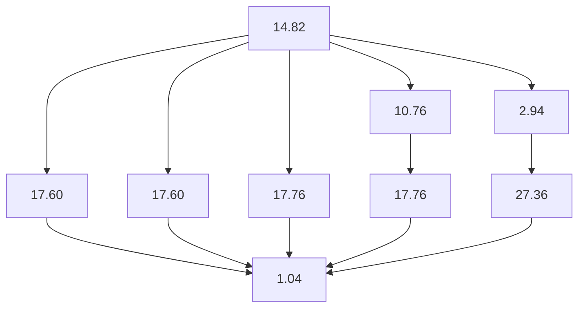
```mermaid
graph TD;
 T0R0C0[14.82]-->T2R1C1[17.60];
 T3R2C2[10.76]-->T5R3C6[17.76];
 T6R3C3[2.94]-->T7R4C4[27.36];
 T0R0C0[14.82]-->T1R1C1[17.60];
 T0R0C0[14.82]-->T3R2C2[10.76];
 T0R0C0[14.82]-->T4R3C6[17.76];
 T0R0C0[14.82]-->T6R3C3[2.94];
 T1R1C1[17.60]-->T8R5C5[1.04];
 T2R1C1[17.60]-->T8R5C5[1.04];
 T4R3C6[17.76]-->T8R5C5[1.04];
 T5R3C6[17.76]-->T8R5C5[1.04];
 T7R4C4[27.36]-->T8R5C5[1.04];
```

### edge_workflows_8
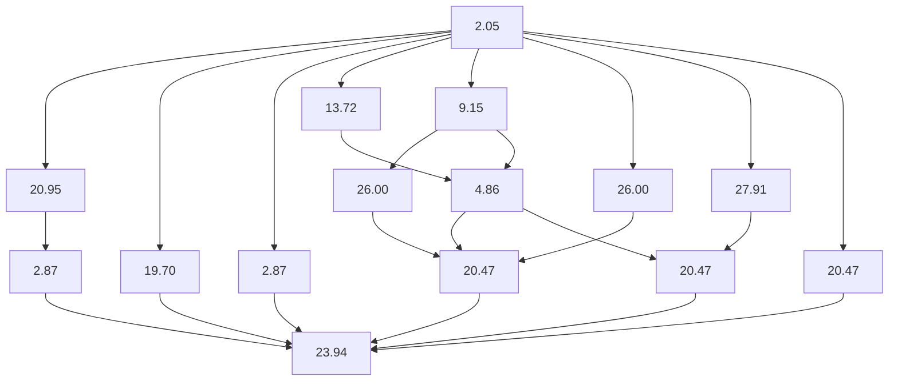
```mermaid
graph TD;
 T0R0C0[2.05]-->T1R1C8[20.95];
 T0R0C0[2.05]-->T2R1C7[19.70];
 T1R1C8[20.95]-->T4R2C2[2.87];
 T6R3C3[9.15]-->T7R4C10[26.00];
 T5R3C1[13.72]-->T10R4C5[4.86];
 T6R3C3[9.15]-->T10R4C5[4.86];
 T7R4C10[26.00]-->T12R5C6[20.47];
 T8R4C10[26.00]-->T12R5C6[20.47];
 T10R4C5[4.86]-->T12R5C6[20.47];
 T9R4C4[27.91]-->T13R5C6[20.47];
 T10R4C5[4.86]-->T13R5C6[20.47];
 T0R0C0[2.05]-->T3R2C2[2.87];
 T0R0C0[2.05]-->T5R3C1[13.72];
 T0R0C0[2.05]-->T6R3C3[9.15];
 T0R0C0[2.05]-->T8R4C10[26.00];
 T0R0C0[2.05]-->T9R4C4[27.91];
 T0R0C0[2.05]-->T11R5C6[20.47];
 T2R1C7[19.70]-->T14R6C9[23.94];
 T3R2C2[2.87]-->T14R6C9[23.94];
 T4R2C2[2.87]-->T14R6C9[23.94];
 T11R5C6[20.47]-->T14R6C9[23.94];
 T12R5C6[20.47]-->T14R6C9[23.94];
 T13R5C6[20.47]-->T14R6C9[23.94];
```

### edge_workflows_9
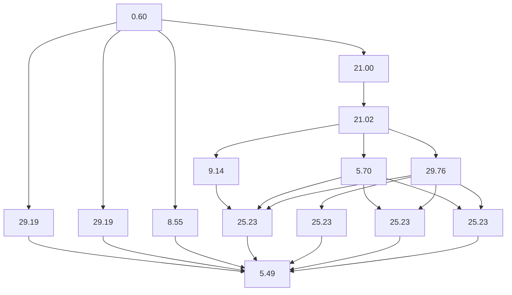
```mermaid
graph TD;
 T0R0C7[0.60]-->T1R1C3[21.00];
 T0R0C7[0.60]-->T2R1C8[29.19];
 T0R0C7[0.60]-->T3R1C8[29.19];
 T1R1C3[21.00]-->T5R2C9[21.02];
 T5R2C9[21.02]-->T6R3C0[9.14];
 T5R2C9[21.02]-->T7R3C4[5.70];
 T5R2C9[21.02]-->T8R3C5[29.76];
 T6R3C0[9.14]-->T9R4C1[25.23];
 T7R3C4[5.70]-->T9R4C1[25.23];
 T8R3C5[29.76]-->T9R4C1[25.23];
 T8R3C5[29.76]-->T10R4C1[25.23];
 T7R3C4[5.70]-->T11R4C1[25.23];
 T8R3C5[29.76]-->T11R4C1[25.23];
 T7R3C4[5.70]-->T12R4C1[25.23];
 T8R3C5[29.76]-->T12R4C1[25.23];
 T0R0C7[0.60]-->T4R2C2[8.55];
 T2R1C8[29.19]-->T13R5C6[5.49];
 T3R1C8[29.19]-->T13R5C6[5.49];
 T4R2C2[8.55]-->T13R5C6[5.49];
 T9R4C1[25.23]-->T13R5C6[5.49];
 T10R4C1[25.23]-->T13R5C6[5.49];
 T11R4C1[25.23]-->T13R5C6[5.49];
 T12R4C1[25.23]-->T13R5C6[5.49];
```

### edge_workflows_10
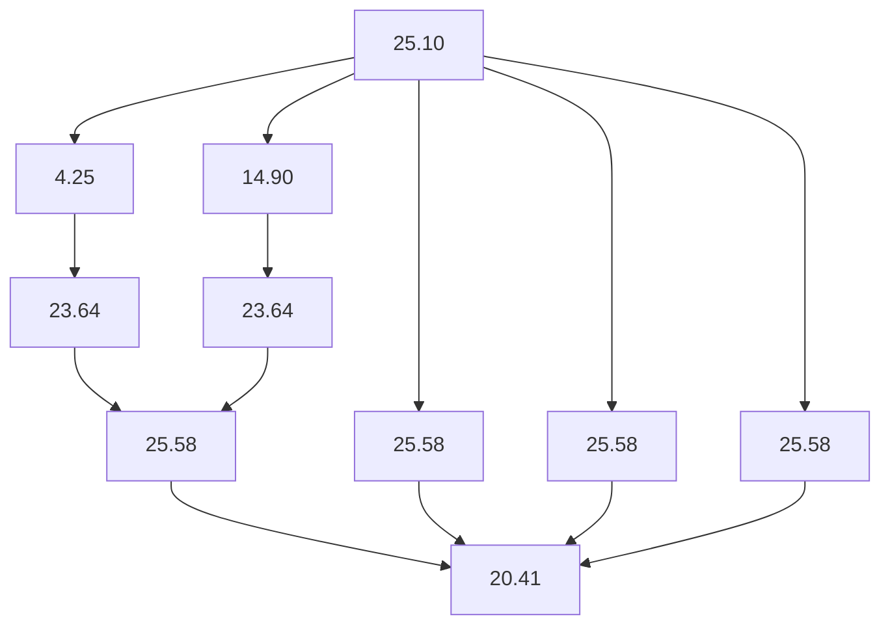
```mermaid
graph TD;
 T0R0C2[25.10]-->T1R1C3[4.25];
 T1R1C3[4.25]-->T3R2C4[23.64];
 T2R1C5[14.90]-->T4R2C4[23.64];
 T3R2C4[23.64]-->T8R3C1[25.58];
 T4R2C4[23.64]-->T8R3C1[25.58];
 T0R0C2[25.10]-->T2R1C5[14.90];
 T0R0C2[25.10]-->T5R3C1[25.58];
 T0R0C2[25.10]-->T6R3C1[25.58];
 T0R0C2[25.10]-->T7R3C1[25.58];
 T8R3C1[25.58]-->T9R4C0[20.41];
 T5R3C1[25.58]-->T9R4C0[20.41];
 T6R3C1[25.58]-->T9R4C0[20.41];
 T7R3C1[25.58]-->T9R4C0[20.41];
```

### edge_workflows_11
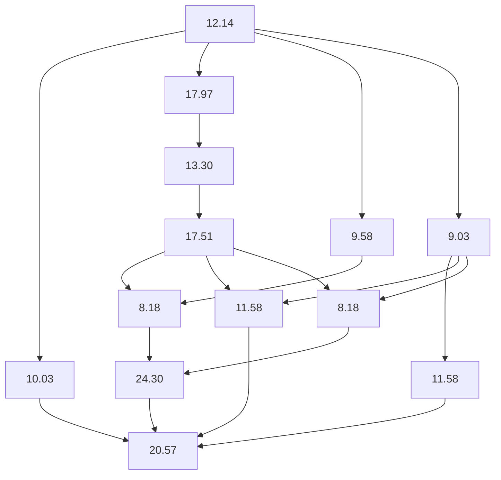
```mermaid
graph TD;
 T0R0C9[12.14]-->T2R1C2[10.03];
 T1R1C4[17.97]-->T3R2C5[13.30];
 T3R2C5[13.30]-->T4R3C6[17.51];
 T4R3C6[17.51]-->T7R4C1[8.18];
 T5R3C3[9.58]-->T7R4C1[8.18];
 T6R3C10[9.03]-->T8R4C8[11.58];
 T4R3C6[17.51]-->T9R4C8[11.58];
 T6R3C10[9.03]-->T9R4C8[11.58];
 T4R3C6[17.51]-->T10R4C1[8.18];
 T6R3C10[9.03]-->T10R4C1[8.18];
 T7R4C1[8.18]-->T11R5C0[24.30];
 T10R4C1[8.18]-->T11R5C0[24.30];
 T0R0C9[12.14]-->T1R1C4[17.97];
 T0R0C9[12.14]-->T5R3C3[9.58];
 T0R0C9[12.14]-->T6R3C10[9.03];
 T8R4C8[11.58]-->T12R6C7[20.57];
 T9R4C8[11.58]-->T12R6C7[20.57];
 T2R1C2[10.03]-->T12R6C7[20.57];
 T11R5C0[24.30]-->T12R6C7[20.57];
```

### edge_workflows_12
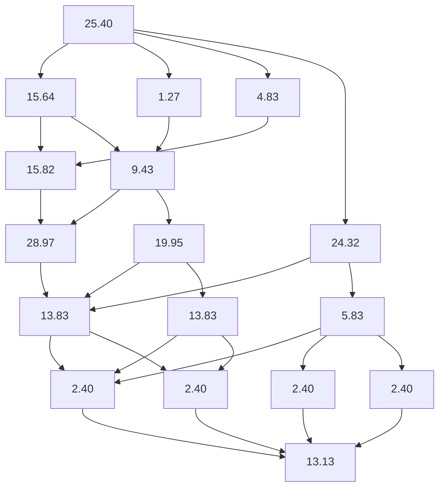
```mermaid
graph TD;
 T1R1C1[15.64]-->T4R2C3[15.82];
 T3R1C11[4.83]-->T4R2C3[15.82];
 T1R1C1[15.64]-->T5R2C0[9.43];
 T2R1C8[1.27]-->T5R2C0[9.43];
 T4R2C3[15.82]-->T7R3C2[28.97];
 T5R2C0[9.43]-->T7R3C2[28.97];
 T5R2C0[9.43]-->T8R3C5[19.95];
 T6R3C7[24.32]-->T9R4C4[13.83];
 T7R3C2[28.97]-->T9R4C4[13.83];
 T8R3C5[19.95]-->T9R4C4[13.83];
 T6R3C7[24.32]-->T10R4C10[5.83];
 T8R3C5[19.95]-->T11R4C4[13.83];
 T9R4C4[13.83]-->T12R5C6[2.40];
 T10R4C10[5.83]-->T12R5C6[2.40];
 T11R4C4[13.83]-->T12R5C6[2.40];
 T10R4C10[5.83]-->T13R5C6[2.40];
 T10R4C10[5.83]-->T14R5C6[2.40];
 T9R4C4[13.83]-->T15R5C6[2.40];
 T11R4C4[13.83]-->T15R5C6[2.40];
 T0R0C9[25.40]-->T1R1C1[15.64];
 T0R0C9[25.40]-->T2R1C8[1.27];
 T0R0C9[25.40]-->T3R1C11[4.83];
 T0R0C9[25.40]-->T6R3C7[24.32];
 T12R5C6[2.40]-->T16R6C12[13.13];
 T13R5C6[2.40]-->T16R6C12[13.13];
 T14R5C6[2.40]-->T16R6C12[13.13];
 T15R5C6[2.40]-->T16R6C12[13.13];
```

### edge_workflows_13
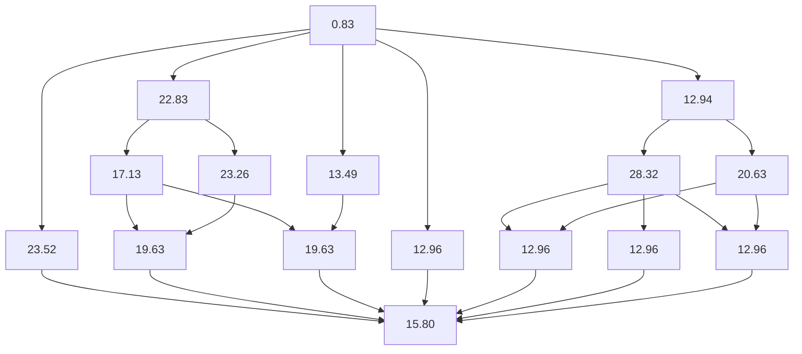
```mermaid
graph TD;
 T0R0C2[0.83]-->T2R1C8[22.83];
 T2R1C8[22.83]-->T3R2C11[17.13];
 T2R1C8[22.83]-->T5R2C9[23.26];
 T3R2C11[17.13]-->T6R3C6[19.63];
 T5R2C9[23.26]-->T6R3C6[19.63];
 T3R2C11[17.13]-->T7R3C6[19.63];
 T4R2C0[13.49]-->T7R3C6[19.63];
 T8R3C4[12.94]-->T9R4C5[28.32];
 T8R3C4[12.94]-->T10R4C1[20.63];
 T9R4C5[28.32]-->T12R5C3[12.96];
 T10R4C1[20.63]-->T12R5C3[12.96];
 T9R4C5[28.32]-->T13R5C3[12.96];
 T9R4C5[28.32]-->T14R5C3[12.96];
 T10R4C1[20.63]-->T14R5C3[12.96];
 T0R0C2[0.83]-->T1R1C10[23.52];
 T0R0C2[0.83]-->T4R2C0[13.49];
 T0R0C2[0.83]-->T8R3C4[12.94];
 T0R0C2[0.83]-->T11R5C3[12.96];
 T1R1C10[23.52]-->T15R6C7[15.80];
 T6R3C6[19.63]-->T15R6C7[15.80];
 T7R3C6[19.63]-->T15R6C7[15.80];
 T11R5C3[12.96]-->T15R6C7[15.80];
 T12R5C3[12.96]-->T15R6C7[15.80];
 T13R5C3[12.96]-->T15R6C7[15.80];
 T14R5C3[12.96]-->T15R6C7[15.80];
```

### edge_workflows_14
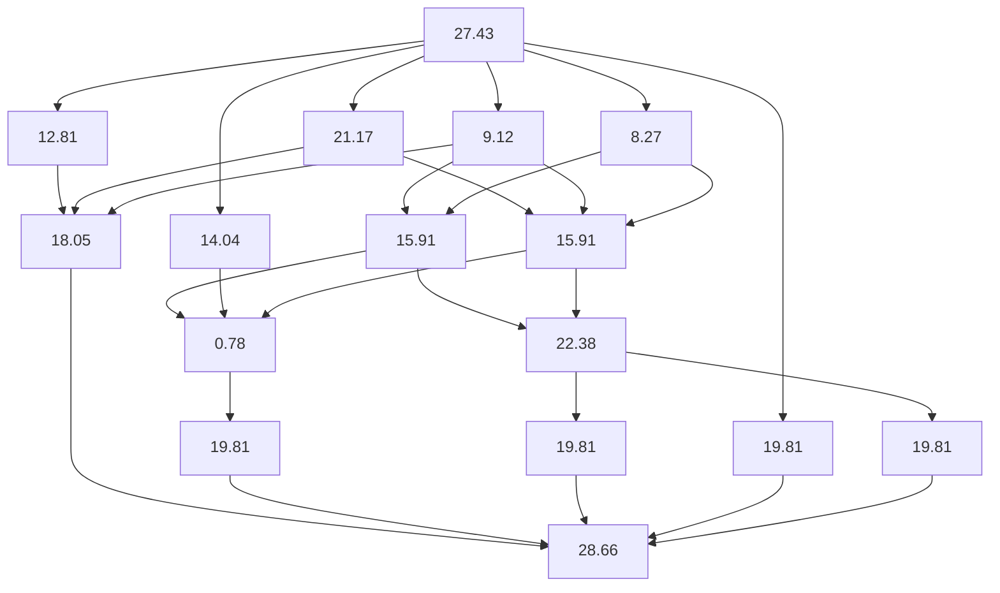
```mermaid
graph TD;
 T0R0C10[27.43]-->T2R1C11[21.17];
 T0R0C10[27.43]-->T4R1C1[8.27];
 T3R1C6[9.12]-->T5R2C4[15.91];
 T4R1C1[8.27]-->T5R2C4[15.91];
 T1R1C2[12.81]-->T6R2C9[18.05];
 T2R1C11[21.17]-->T6R2C9[18.05];
 T3R1C6[9.12]-->T6R2C9[18.05];
 T2R1C11[21.17]-->T8R2C4[15.91];
 T3R1C6[9.12]-->T8R2C4[15.91];
 T4R1C1[8.27]-->T8R2C4[15.91];
 T5R2C4[15.91]-->T9R3C5[0.78];
 T7R2C0[14.04]-->T9R3C5[0.78];
 T8R2C4[15.91]-->T9R3C5[0.78];
 T5R2C4[15.91]-->T10R3C3[22.38];
 T8R2C4[15.91]-->T10R3C3[22.38];
 T9R3C5[0.78]-->T11R4C7[19.81];
 T10R3C3[22.38]-->T12R4C7[19.81];
 T10R3C3[22.38]-->T14R4C7[19.81];
 T0R0C10[27.43]-->T1R1C2[12.81];
 T0R0C10[27.43]-->T3R1C6[9.12];
 T0R0C10[27.43]-->T7R2C0[14.04];
 T0R0C10[27.43]-->T13R4C7[19.81];
 T6R2C9[18.05]-->T15R5C8[28.66];
 T11R4C7[19.81]-->T15R5C8[28.66];
 T12R4C7[19.81]-->T15R5C8[28.66];
 T13R4C7[19.81]-->T15R5C8[28.66];
 T14R4C7[19.81]-->T15R5C8[28.66];
```

### edge_workflows_15
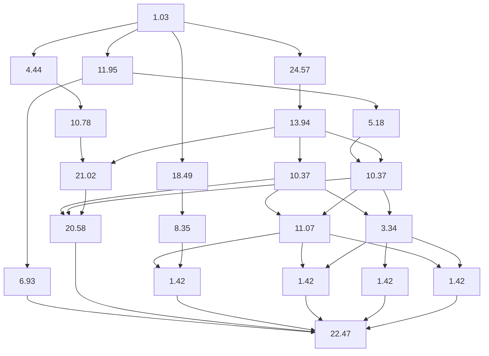
```mermaid
graph TD;
 T1R1C11[4.44]-->T4R2C6[10.78];
 T3R1C8[11.95]-->T5R2C16[5.18];
 T2R1C1[24.57]-->T6R2C4[13.94];
 T3R1C8[11.95]-->T7R2C5[6.93];
 T6R2C4[13.94]-->T8R3C7[10.37];
 T5R2C16[5.18]-->T10R3C7[10.37];
 T6R2C4[13.94]-->T10R3C7[10.37];
 T4R2C6[10.78]-->T11R3C9[21.02];
 T6R2C4[13.94]-->T11R3C9[21.02];
 T8R3C7[10.37]-->T12R4C12[11.07];
 T10R3C7[10.37]-->T12R4C12[11.07];
 T8R3C7[10.37]-->T13R4C0[20.58];
 T10R3C7[10.37]-->T13R4C0[20.58];
 T11R3C9[21.02]-->T13R4C0[20.58];
 T9R3C2[18.49]-->T14R4C15[8.35];
 T8R3C7[10.37]-->T15R4C14[3.34];
 T10R3C7[10.37]-->T15R4C14[3.34];
 T12R4C12[11.07]-->T16R5C10[1.42];
 T14R4C15[8.35]-->T16R5C10[1.42];
 T12R4C12[11.07]-->T17R5C10[1.42];
 T15R4C14[3.34]-->T17R5C10[1.42];
 T15R4C14[3.34]-->T18R5C10[1.42];
 T12R4C12[11.07]-->T19R5C10[1.42];
 T15R4C14[3.34]-->T19R5C10[1.42];
 T0R0C3[1.03]-->T1R1C11[4.44];
 T0R0C3[1.03]-->T2R1C1[24.57];
 T0R0C3[1.03]-->T3R1C8[11.95];
 T0R0C3[1.03]-->T9R3C2[18.49];
 T7R2C5[6.93]-->T20R6C13[22.47];
 T13R4C0[20.58]-->T20R6C13[22.47];
 T16R5C10[1.42]-->T20R6C13[22.47];
 T17R5C10[1.42]-->T20R6C13[22.47];
 T18R5C10[1.42]-->T20R6C13[22.47];
 T19R5C10[1.42]-->T20R6C13[22.47];
```

### edge_workflows_16
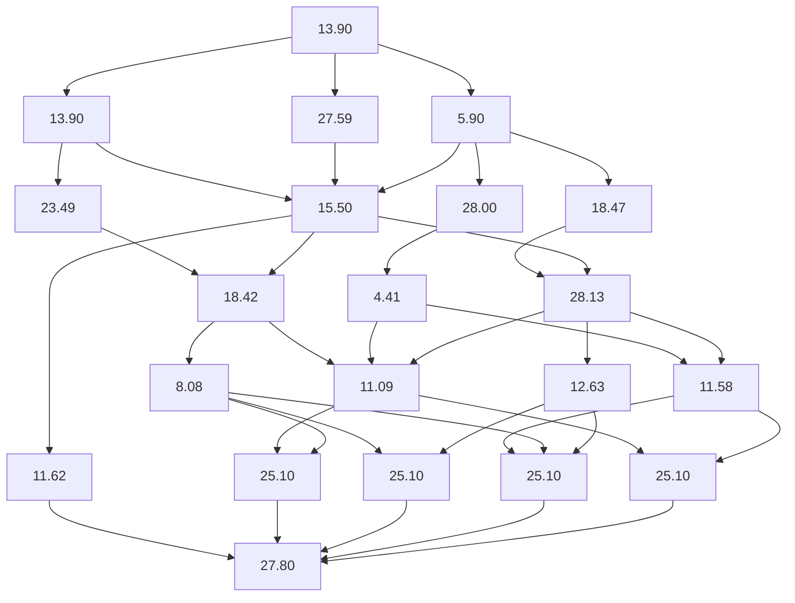
```mermaid
graph TD;
 T0R0C3[13.90]-->T2R1C10[27.59];
 T0R0C3[13.90]-->T3R1C7[5.90];
 T3R1C7[5.90]-->T4R2C1[28.00];
 T1R1C9[13.90]-->T5R2C12[23.49];
 T3R1C7[5.90]-->T6R2C17[18.47];
 T1R1C9[13.90]-->T7R2C5[15.50];
 T2R1C10[27.59]-->T7R2C5[15.50];
 T3R1C7[5.90]-->T7R2C5[15.50];
 T5R2C12[23.49]-->T8R3C2[18.42];
 T7R2C5[15.50]-->T8R3C2[18.42];
 T4R2C1[28.00]-->T9R3C13[4.41];
 T6R2C17[18.47]-->T10R3C6[28.13];
 T7R2C5[15.50]-->T10R3C6[28.13];
 T7R2C5[15.50]-->T11R3C8[11.62];
 T8R3C2[18.42]-->T12R4C4[11.09];
 T9R3C13[4.41]-->T12R4C4[11.09];
 T10R3C6[28.13]-->T12R4C4[11.09];
 T9R3C13[4.41]-->T13R4C14[11.58];
 T10R3C6[28.13]-->T13R4C14[11.58];
 T8R3C2[18.42]-->T14R4C0[8.08];
 T10R3C6[28.13]-->T15R4C16[12.63];
 T12R4C4[11.09]-->T16R5C11[25.10];
 T14R4C0[8.08]-->T16R5C11[25.10];
 T14R4C0[8.08]-->T17R5C11[25.10];
 T15R4C16[12.63]-->T17R5C11[25.10];
 T13R4C14[11.58]-->T18R5C11[25.10];
 T14R4C0[8.08]-->T18R5C11[25.10];
 T15R4C16[12.63]-->T18R5C11[25.10];
 T12R4C4[11.09]-->T19R5C11[25.10];
 T13R4C14[11.58]-->T19R5C11[25.10];
 T0R0C3[13.90]-->T1R1C9[13.90];
 T11R3C8[11.62]-->T20R6C15[27.80];
 T16R5C11[25.10]-->T20R6C15[27.80];
 T17R5C11[25.10]-->T20R6C15[27.80];
 T18R5C11[25.10]-->T20R6C15[27.80];
 T19R5C11[25.10]-->T20R6C15[27.80];
```

### edge_workflows_17
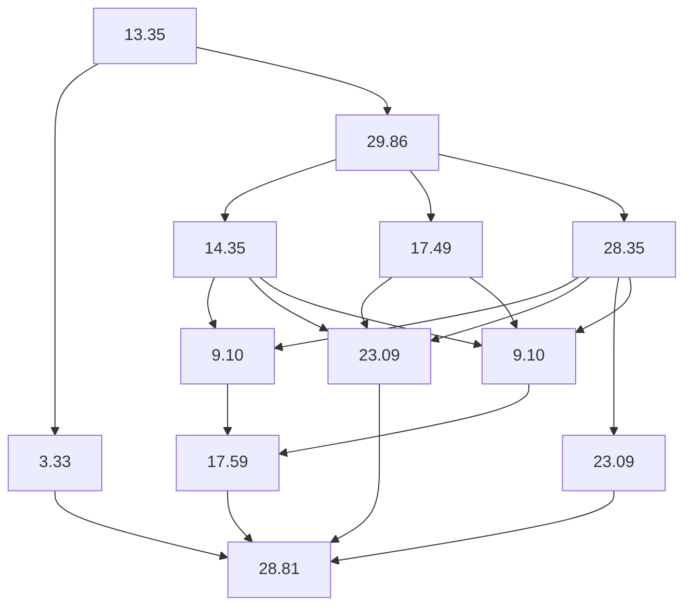
```mermaid
graph TD;
 T0R0C2[13.35]-->T1R1C8[3.33];
 T0R0C2[13.35]-->T2R1C9[29.86];
 T2R1C9[29.86]-->T3R2C3[14.35];
 T2R1C9[29.86]-->T4R2C5[17.49];
 T2R1C9[29.86]-->T5R2C4[28.35];
 T3R2C3[14.35]-->T6R3C0[9.10];
 T5R2C4[28.35]-->T6R3C0[9.10];
 T3R2C3[14.35]-->T7R3C6[23.09];
 T4R2C5[17.49]-->T7R3C6[23.09];
 T5R2C4[28.35]-->T7R3C6[23.09];
 T5R2C4[28.35]-->T8R3C6[23.09];
 T3R2C3[14.35]-->T9R3C0[9.10];
 T4R2C5[17.49]-->T9R3C0[9.10];
 T5R2C4[28.35]-->T9R3C0[9.10];
 T6R3C0[9.10]-->T10R4C1[17.59];
 T9R3C0[9.10]-->T10R4C1[17.59];
 T8R3C6[23.09]-->T11R5C7[28.81];
 T1R1C8[3.33]-->T11R5C7[28.81];
 T10R4C1[17.59]-->T11R5C7[28.81];
 T7R3C6[23.09]-->T11R5C7[28.81];
```

### edge_workflows_18
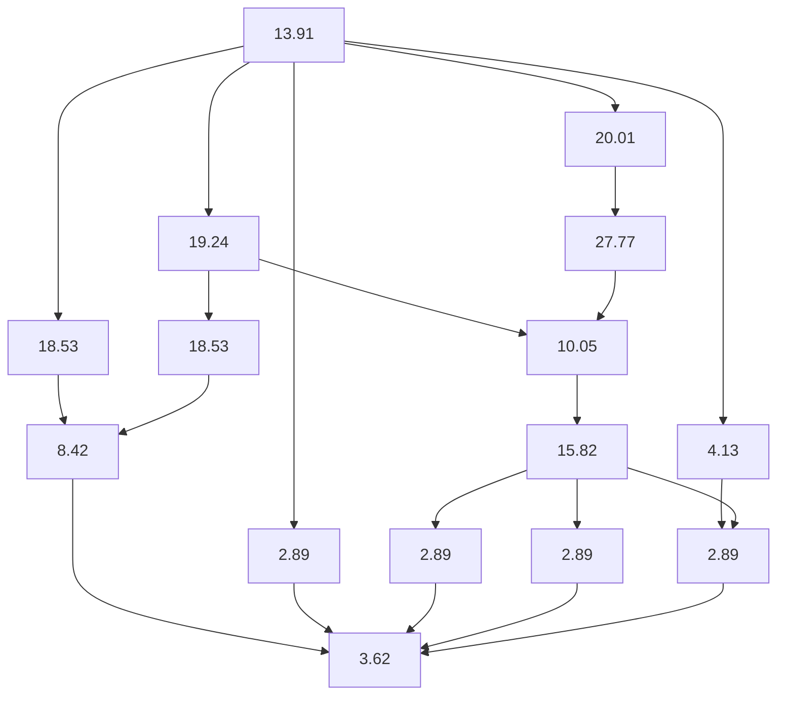
```mermaid
graph TD;
 T0R0C1[13.91]-->T1R1C4[20.01];
 T1R1C4[20.01]-->T3R2C9[27.77];
 T2R2C5[19.24]-->T5R3C0[18.53];
 T2R2C5[19.24]-->T6R3C8[10.05];
 T3R2C9[27.77]-->T6R3C8[10.05];
 T6R3C8[10.05]-->T8R4C6[15.82];
 T4R3C0[18.53]-->T9R4C10[8.42];
 T5R3C0[18.53]-->T9R4C10[8.42];
 T8R4C6[15.82]-->T11R5C3[2.89];
 T8R4C6[15.82]-->T12R5C3[2.89];
 T7R4C2[4.13]-->T13R5C3[2.89];
 T8R4C6[15.82]-->T13R5C3[2.89];
 T0R0C1[13.91]-->T2R2C5[19.24];
 T0R0C1[13.91]-->T4R3C0[18.53];
 T0R0C1[13.91]-->T7R4C2[4.13];
 T0R0C1[13.91]-->T10R5C3[2.89];
 T9R4C10[8.42]-->T14R6C7[3.62];
 T10R5C3[2.89]-->T14R6C7[3.62];
 T11R5C3[2.89]-->T14R6C7[3.62];
 T12R5C3[2.89]-->T14R6C7[3.62];
 T13R5C3[2.89]-->T14R6C7[3.62];
```

### edge_workflows_19
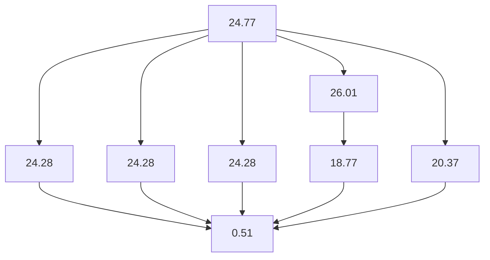
```mermaid
graph TD;
 T0R0C1[24.77]-->T1R1C5[24.28];
 T3R1C4[26.01]-->T5R2C2[18.77];
 T0R0C1[24.77]-->T2R1C5[24.28];
 T0R0C1[24.77]-->T3R1C4[26.01];
 T0R0C1[24.77]-->T4R1C5[24.28];
 T0R0C1[24.77]-->T6R3C3[20.37];
 T1R1C5[24.28]-->T7R4C0[0.51];
 T2R1C5[24.28]-->T7R4C0[0.51];
 T4R1C5[24.28]-->T7R4C0[0.51];
 T5R2C2[18.77]-->T7R4C0[0.51];
 T6R3C3[20.37]-->T7R4C0[0.51];
```

### edge_workflows_20
```mermaid
graph TD;
 T0R0C6[18.10]-->T1R1C3[0.94];
 T0R0C6[18.10]-->T4R1C5[26.19];
 T3R1C0[1.40]-->T5R2C7[12.51];
 T1R1C3[0.94]-->T6R2C4[26.35];
 T3R1C0[1.40]-->T6R2C4[26.35];
 T2R1C5[26.19]-->T7R2C7[12.51];
 T4R1C5[26.19]-->T7R2C7[12.51];
 T5R2C7[12.51]-->T8R3C1[0.73];
 T6R2C4[26.35]-->T8R3C1[0.73];
 T7R2C7[12.51]-->T8R3C1[0.73];
 T6R2C4[26.35]-->T9R3C1[0.73];
 T0R0C6[18.10]-->T2R1C5[26.19];
 T0R0C6[18.10]-->T3R1C0[1.40];
 T8R3C1[0.73]-->T10R4C2[13.28];
 T9R3C1[0.73]-->T10R4C2[13.28];
```

### edge_workflows_21
```mermaid
graph TD;
 T0R0C2[24.23]-->T1R1C3[1.26];
 T1R1C3[1.26]-->T3R2C4[19.61];
 T2R2C4[19.61]-->T4R3C1[27.33];
 T3R2C4[19.61]-->T4R3C1[27.33];
 T0R0C2[24.23]-->T2R2C4[19.61];
 T4R3C1[27.33]-->T5R4C0[18.38];
```

### edge_workflows_22
```mermaid
graph TD;
 T0R0C2[8.95]-->T1R1C8[3.61];
 T1R1C8[3.61]-->T2R2C3[3.78];
 T2R2C3[3.78]-->T4R3C7[10.08];
 T6R3C1[29.95]-->T7R4C4[15.60];
 T3R3C7[10.08]-->T8R4C0[20.81];
 T4R3C7[10.08]-->T8R4C0[20.81];
 T5R3C7[10.08]-->T8R4C0[20.81];
 T7R4C4[15.60]-->T10R5C6[28.39];
 T0R0C2[8.95]-->T3R3C7[10.08];
 T0R0C2[8.95]-->T5R3C7[10.08];
 T0R0C2[8.95]-->T6R3C1[29.95];
 T0R0C2[8.95]-->T9R5C6[28.39];
 T0R0C2[8.95]-->T11R5C6[28.39];
 T0R0C2[8.95]-->T12R5C6[28.39];
 T8R4C0[20.81]-->T13R6C5[14.96];
 T9R5C6[28.39]-->T13R6C5[14.96];
 T10R5C6[28.39]-->T13R6C5[14.96];
 T11R5C6[28.39]-->T13R6C5[14.96];
 T12R5C6[28.39]-->T13R6C5[14.96];
```

### edge_workflows_23
```mermaid
graph TD;
 T0R0C5[10.25]-->T1R1C2[12.26];
 T1R1C2[12.26]-->T4R2C6[3.31];
 T2R2C1[3.16]-->T5R3C4[11.30];
 T2R2C1[3.16]-->T6R3C4[11.30];
 T4R2C6[3.31]-->T6R3C4[11.30];
 T4R2C6[3.31]-->T7R3C4[11.30];
 T0R0C5[10.25]-->T2R2C1[3.16];
 T0R0C5[10.25]-->T3R2C3[12.22];
 T3R2C3[12.22]-->T8R4C0[1.42];
 T5R3C4[11.30]-->T8R4C0[1.42];
 T6R3C4[11.30]-->T8R4C0[1.42];
 T7R3C4[11.30]-->T8R4C0[1.42];
```

### edge_workflows_24
```mermaid
graph TD;
 T1R1C8[27.91]-->T4R2C6[15.17];
 T2R1C8[27.91]-->T4R2C6[15.17];
 T3R2C7[15.20]-->T5R3C0[12.88];
 T4R2C6[15.17]-->T5R3C0[12.88];
 T3R2C7[15.20]-->T6R3C2[15.82];
 T4R2C6[15.17]-->T6R3C2[15.82];
 T3R2C7[15.20]-->T7R3C4[19.54];
 T3R2C7[15.20]-->T8R3C3[15.58];
 T8R3C3[15.58]-->T9R4C1[7.12];
 T5R3C0[12.88]-->T11R4C1[7.12];
 T6R3C2[15.82]-->T11R4C1[7.12];
 T8R3C3[15.58]-->T11R4C1[7.12];
 T5R3C0[12.88]-->T12R4C1[7.12];
 T8R3C3[15.58]-->T12R4C1[7.12];
 T0R0C9[27.78]-->T1R1C8[27.91];
 T0R0C9[27.78]-->T2R1C8[27.91];
 T0R0C9[27.78]-->T3R2C7[15.20];
 T0R0C9[27.78]-->T10R4C1[7.12];
 T7R3C4[19.54]-->T13R5C5[23.58];
 T9R4C1[7.12]-->T13R5C5[23.58];
 T10R4C1[7.12]-->T13R5C5[23.58];
 T11R4C1[7.12]-->T13R5C5[23.58];
 T12R4C1[7.12]-->T13R5C5[23.58];
```

### edge_workflows_25
```mermaid
graph TD;
 T0R0C3[22.69]-->T1R1C1[7.74];
 T1R1C1[7.74]-->T3R2C2[27.00];
 T2R1C1[7.74]-->T3R2C2[27.00];
 T3R2C2[27.00]-->T4R3C4[24.37];
 T0R0C3[22.69]-->T2R1C1[7.74];
 T0R0C3[22.69]-->T5R3C4[24.37];
 T4R3C4[24.37]-->T6R4C0[11.93];
 T5R3C4[24.37]-->T6R4C0[11.93];
```

### edge_workflows_26
```mermaid
graph TD;
 T0R0C4[22.94]-->T1R1C1[9.81];
 T2R1C2[13.76]-->T3R2C3[7.52];
 T3R2C3[7.52]-->T4R3C5[16.58];
 T0R0C4[22.94]-->T2R1C2[13.76];
 T0R0C4[22.94]-->T5R3C5[16.58];
 T1R1C1[9.81]-->T6R4C0[9.22];
 T4R3C5[16.58]-->T6R4C0[9.22];
 T5R3C5[16.58]-->T6R4C0[9.22];
```

### edge_workflows_27
```mermaid
graph TD;
 T0R0C10[1.40]-->T1R1C7[3.77];
 T0R0C10[1.40]-->T2R1C0[3.27];
 T0R0C10[1.40]-->T3R1C6[18.93];
 T1R1C7[3.77]-->T5R2C5[3.37];
 T2R1C0[3.27]-->T5R2C5[3.37];
 T3R1C6[18.93]-->T5R2C5[3.37];
 T2R1C0[3.27]-->T6R2C3[8.14];
 T4R1C2[14.78]-->T6R2C3[8.14];
 T2R1C0[3.27]-->T7R2C1[1.16];
 T3R1C6[18.93]-->T7R2C1[1.16];
 T5R2C5[3.37]-->T8R3C11[9.47];
 T7R2C1[1.16]-->T8R3C11[9.47];
 T5R2C5[3.37]-->T9R3C8[22.76];
 T6R2C3[8.14]-->T9R3C8[22.76];
 T7R2C1[1.16]-->T9R3C8[22.76];
 T7R2C1[1.16]-->T10R3C8[22.76];
 T5R2C5[3.37]-->T11R3C8[22.76];
 T6R2C3[8.14]-->T11R3C8[22.76];
 T7R2C1[1.16]-->T11R3C8[22.76];
 T8R3C11[9.47]-->T12R4C4[8.05];
 T0R0C10[1.40]-->T4R1C2[14.78];
 T9R3C8[22.76]-->T13R5C9[10.55];
 T10R3C8[22.76]-->T13R5C9[10.55];
 T11R3C8[22.76]-->T13R5C9[10.55];
 T12R4C4[8.05]-->T13R5C9[10.55];
```

### edge_workflows_28
```mermaid
graph TD;
 T0R0C8[8.60]-->T3R1C1[6.83];
 T0R0C8[8.60]-->T4R1C7[2.43];
 T1R1C4[10.48]-->T5R2C6[12.07];
 T3R1C1[6.83]-->T5R2C6[12.07];
 T3R1C1[6.83]-->T6R2C0[22.90];
 T6R2C0[22.90]-->T7R3C3[9.71];
 T5R2C6[12.07]-->T8R3C3[9.71];
 T6R2C0[22.90]-->T8R3C3[9.71];
 T7R3C3[9.71]-->T9R4C2[22.83];
 T8R3C3[9.71]-->T9R4C2[22.83];
 T0R0C8[8.60]-->T1R1C4[10.48];
 T0R0C8[8.60]-->T2R1C7[2.43];
 T0R0C8[8.60]-->T10R4C2[22.83];
 T9R4C2[22.83]-->T11R5C5[19.29];
 T2R1C7[2.43]-->T11R5C5[19.29];
 T10R4C2[22.83]-->T11R5C5[19.29];
 T4R1C7[2.43]-->T11R5C5[19.29];
```

### edge_workflows_29
```mermaid
graph TD;
 T0R0C2[20.01]-->T1R1C1[18.22];
 T0R0C2[20.01]-->T2R1C5[24.70];
 T0R0C2[20.01]-->T3R1C5[24.70];
 T2R1C5[24.70]-->T4R2C6[28.09];
 T3R1C5[24.70]-->T4R2C6[28.09];
 T1R1C1[18.22]-->T5R2C6[28.09];
 T4R2C6[28.09]-->T8R3C4[3.81];
 T5R2C6[28.09]-->T8R3C4[3.81];
 T7R3C10[11.47]-->T10R4C0[29.80];
 T7R3C10[11.47]-->T11R4C3[8.29];
 T11R4C3[8.29]-->T12R5C8[3.41];
 T11R4C3[8.29]-->T13R5C8[3.41];
 T9R4C9[26.79]-->T14R5C8[3.41];
 T11R4C3[8.29]-->T14R5C8[3.41];
 T0R0C2[20.01]-->T9R4C9[26.79];
 T0R0C2[20.01]-->T6R3C4[3.81];
 T0R0C2[20.01]-->T7R3C10[11.47];
 T6R3C4[3.81]-->T15R6C7[11.47];
 T8R3C4[3.81]-->T15R6C7[11.47];
 T10R4C0[29.80]-->T15R6C7[11.47];
 T12R5C8[3.41]-->T15R6C7[11.47];
 T13R5C8[3.41]-->T15R6C7[11.47];
 T14R5C8[3.41]-->T15R6C7[11.47];
```

### edge_workflows_30
```mermaid
graph TD;
 T0R0C1[10.89]-->T1R1C3[8.61];
 T2R2C0[29.25]-->T3R3C4[21.35];
 T3R3C4[21.35]-->T6R4C5[14.15];
 T4R3C4[21.35]-->T6R4C5[14.15];
 T5R3C4[21.35]-->T6R4C5[14.15];
 T0R0C1[10.89]-->T2R2C0[29.25];
 T0R0C1[10.89]-->T4R3C4[21.35];
 T0R0C1[10.89]-->T5R3C4[21.35];
 T1R1C3[8.61]-->T7R5C2[17.64];
 T6R4C5[14.15]-->T7R5C2[17.64];
```

### edge_workflows_31
```mermaid
graph TD;
 T1R1C5[8.79]-->T2R2C2[17.73];
 T2R2C2[17.73]-->T3R3C7[15.42];
 T2R2C2[17.73]-->T4R3C0[8.90];
 T2R2C2[17.73]-->T5R3C1[9.57];
 T3R3C7[15.42]-->T6R4C4[22.65];
 T5R3C1[9.57]-->T6R4C4[22.65];
 T4R3C0[8.90]-->T7R4C4[22.65];
 T4R3C0[8.90]-->T8R4C4[22.65];
 T5R3C1[9.57]-->T8R4C4[22.65];
 T5R3C1[9.57]-->T9R4C4[22.65];
 T0R0C6[26.07]-->T1R1C5[8.79];
 T8R4C4[22.65]-->T10R5C3[15.34];
 T9R4C4[22.65]-->T10R5C3[15.34];
 T6R4C4[22.65]-->T10R5C3[15.34];
 T7R4C4[22.65]-->T10R5C3[15.34];
```

### edge_workflows_32
```mermaid
graph TD;
 T0R0C3[24.72]-->T2R1C2[19.25];
 T2R1C2[19.25]-->T3R2C0[27.50];
 T1R1C5[23.77]-->T4R2C1[15.03];
 T2R1C2[19.25]-->T4R2C1[15.03];
 T3R2C0[27.50]-->T5R3C6[2.30];
 T5R3C6[2.30]-->T6R4C7[12.64];
 T0R0C3[24.72]-->T1R1C5[23.77];
 T4R2C1[15.03]-->T7R5C4[13.03];
 T6R4C7[12.64]-->T7R5C4[13.03];
```

### edge_workflows_33
```mermaid
graph TD;
 T0R0C5[27.06]-->T2R1C4[19.73];
 T3R1C1[28.84]-->T5R2C2[2.66];
 T4R1C8[1.39]-->T5R2C2[2.66];
 T2R1C4[19.73]-->T6R2C11[6.39];
 T3R1C1[28.84]-->T6R2C11[6.39];
 T4R1C8[1.39]-->T7R2C11[6.39];
 T5R2C2[2.66]-->T9R3C13[9.20];
 T8R3C9[16.41]-->T11R4C10[23.26];
 T10R3C7[13.38]-->T11R4C10[23.26];
 T9R3C13[9.20]-->T12R4C3[8.07];
 T10R3C7[13.38]-->T12R4C3[8.07];
 T9R3C13[9.20]-->T13R4C10[23.26];
 T10R3C7[13.38]-->T13R4C10[23.26];
 T9R3C13[9.20]-->T14R4C3[8.07];
 T10R3C7[13.38]-->T14R4C3[8.07];
 T11R4C10[23.26]-->T15R5C6[26.39];
 T12R4C3[8.07]-->T15R5C6[26.39];
 T13R4C10[23.26]-->T15R5C6[26.39];
 T14R4C3[8.07]-->T15R5C6[26.39];
 T12R4C3[8.07]-->T16R5C6[26.39];
 T14R4C3[8.07]-->T16R5C6[26.39];
 T0R0C5[27.06]-->T1R1C0[13.50];
 T0R0C5[27.06]-->T3R1C1[28.84];
 T0R0C5[27.06]-->T4R1C8[1.39];
 T0R0C5[27.06]-->T8R3C9[16.41];
 T0R0C5[27.06]-->T10R3C7[13.38];
 T1R1C0[13.50]-->T17R6C12[25.70];
 T6R2C11[6.39]-->T17R6C12[25.70];
 T7R2C11[6.39]-->T17R6C12[25.70];
 T15R5C6[26.39]-->T17R6C12[25.70];
 T16R5C6[26.39]-->T17R6C12[25.70];
```

### edge_workflows_34
```mermaid
graph TD;
 T0R0C6[6.96]-->T1R1C2[8.74];
 T2R1C0[15.19]-->T4R2C8[29.62];
 T1R1C2[8.74]-->T5R2C8[29.62];
 T2R1C0[15.19]-->T5R2C8[29.62];
 T4R2C8[29.62]-->T6R3C7[28.69];
 T5R2C8[29.62]-->T6R3C7[28.69];
 T4R2C8[29.62]-->T7R3C3[27.69];
 T5R2C8[29.62]-->T7R3C3[27.69];
 T7R3C3[27.69]-->T8R4C5[29.41];
 T7R3C3[27.69]-->T9R4C5[29.41];
 T6R3C7[28.69]-->T10R4C5[29.41];
 T6R3C7[28.69]-->T11R4C5[29.41];
 T0R0C6[6.96]-->T2R1C0[15.19];
 T0R0C6[6.96]-->T3R1C1[20.69];
 T3R1C1[20.69]-->T12R5C4[19.92];
 T8R4C5[29.41]-->T12R5C4[19.92];
 T9R4C5[29.41]-->T12R5C4[19.92];
 T10R4C5[29.41]-->T12R5C4[19.92];
 T11R4C5[29.41]-->T12R5C4[19.92];
```

### edge_workflows_35
```mermaid
graph TD;
 T1R1C4[16.00]-->T3R2C3[28.11];
 T4R2C0[8.27]-->T5R3C2[29.37];
 T3R2C3[28.11]-->T7R3C2[29.37];
 T4R2C0[8.27]-->T7R3C2[29.37];
 T0R0C5[17.25]-->T1R1C4[16.00];
 T0R0C5[17.25]-->T2R2C1[19.17];
 T0R0C5[17.25]-->T4R2C0[8.27];
 T0R0C5[17.25]-->T6R3C2[29.37];
 T0R0C5[17.25]-->T8R4C7[25.16];
 T2R2C1[19.17]-->T9R5C6[12.02];
 T5R3C2[29.37]-->T9R5C6[12.02];
 T6R3C2[29.37]-->T9R5C6[12.02];
 T7R3C2[29.37]-->T9R5C6[12.02];
 T8R4C7[25.16]-->T9R5C6[12.02];
```

### edge_workflows_36
```mermaid
graph TD;
 T0R0C7[11.15]-->T1R1C6[16.20];
 T0R0C7[11.15]-->T4R1C0[7.91];
 T1R1C6[16.20]-->T5R2C3[10.93];
 T3R1C4[15.49]-->T5R2C3[10.93];
 T2R1C2[15.81]-->T6R2C8[1.95];
 T1R1C6[16.20]-->T7R2C3[10.93];
 T2R1C2[15.81]-->T7R2C3[10.93];
 T3R1C4[15.49]-->T7R2C3[10.93];
 T1R1C6[16.20]-->T8R2C8[1.95];
 T4R1C0[7.91]-->T8R2C8[1.95];
 T5R2C3[10.93]-->T9R3C5[8.28];
 T7R2C3[10.93]-->T9R3C5[8.28];
 T5R2C3[10.93]-->T10R3C5[8.28];
 T6R2C8[1.95]-->T10R3C5[8.28];
 T7R2C3[10.93]-->T10R3C5[8.28];
 T8R2C8[1.95]-->T10R3C5[8.28];
 T0R0C7[11.15]-->T2R1C2[15.81];
 T0R0C7[11.15]-->T3R1C4[15.49];
 T9R3C5[8.28]-->T11R4C1[12.71];
 T10R3C5[8.28]-->T11R4C1[12.71];
```

### edge_workflows_37
```mermaid
graph TD;
 T1R1C2[3.26]-->T3R2C7[17.61];
 T2R2C6[8.35]-->T5R3C3[26.39];
 T2R2C6[8.35]-->T6R3C0[24.75];
 T3R2C7[17.61]-->T6R3C0[24.75];
 T2R2C6[8.35]-->T7R3C0[24.75];
 T4R3C3[26.39]-->T8R4C5[12.87];
 T5R3C3[26.39]-->T8R4C5[12.87];
 T4R3C3[26.39]-->T9R4C5[12.87];
 T5R3C3[26.39]-->T9R4C5[12.87];
 T6R3C0[24.75]-->T9R4C5[12.87];
 T7R3C0[24.75]-->T9R4C5[12.87];
 T0R0C1[19.44]-->T1R1C2[3.26];
 T0R0C1[19.44]-->T2R2C6[8.35];
 T0R0C1[19.44]-->T4R3C3[26.39];
 T8R4C5[12.87]-->T10R5C4[13.40];
 T9R4C5[12.87]-->T10R5C4[13.40];
```

### edge_workflows_38
```mermaid
graph TD;
 T0R0C2[21.34]-->T1R1C0[19.57];
 T2R1C3[2.02]-->T3R2C4[17.86];
 T2R1C3[2.02]-->T4R2C5[1.07];
 T3R2C4[17.86]-->T5R3C6[8.36];
 T4R2C5[1.07]-->T5R3C6[8.36];
 T3R2C4[17.86]-->T6R3C6[8.36];
 T4R2C5[1.07]-->T6R3C6[8.36];
 T4R2C5[1.07]-->T7R3C6[8.36];
 T0R0C2[21.34]-->T2R1C3[2.02];
 T1R1C0[19.57]-->T8R4C1[23.12];
 T5R3C6[8.36]-->T8R4C1[23.12];
 T6R3C6[8.36]-->T8R4C1[23.12];
 T7R3C6[8.36]-->T8R4C1[23.12];
```

### edge_workflows_39
```mermaid
graph TD;
 T0R0C7[19.86]-->T1R1C2[24.04];
 T0R0C7[19.86]-->T2R1C2[24.04];
 T1R1C2[24.04]-->T3R2C6[21.51];
 T2R1C2[24.04]-->T3R2C6[21.51];
 T3R2C6[21.51]-->T4R3C0[28.62];
 T3R2C6[21.51]-->T5R3C1[3.68];
 T7R3C5[16.28]-->T8R4C4[7.67];
 T5R3C1[3.68]-->T9R4C4[7.67];
 T0R0C7[19.86]-->T6R3C0[28.62];
 T0R0C7[19.86]-->T7R3C5[16.28];
 T8R4C4[7.67]-->T10R5C3[13.32];
 T9R4C4[7.67]-->T10R5C3[13.32];
 T4R3C0[28.62]-->T10R5C3[13.32];
 T6R3C0[28.62]-->T10R5C3[13.32];
```

### edge_workflows_40
```mermaid
graph TD;
 T0R0C6[1.80]-->T2R1C5[0.87];
 T1R1C3[14.18]-->T5R2C0[1.25];
 T4R1C3[14.18]-->T5R2C0[1.25];
 T5R2C0[1.25]-->T7R3C2[1.80];
 T5R2C0[1.25]-->T8R3C2[1.80];
 T0R0C6[1.80]-->T1R1C3[14.18];
 T0R0C6[1.80]-->T3R1C5[0.87];
 T0R0C6[1.80]-->T4R1C3[14.18];
 T0R0C6[1.80]-->T6R3C2[1.80];
 T0R0C6[1.80]-->T9R3C2[1.80];
 T0R0C6[1.80]-->T10R4C1[11.46];
 T2R1C5[0.87]-->T11R5C4[15.46];
 T3R1C5[0.87]-->T11R5C4[15.46];
 T6R3C2[1.80]-->T11R5C4[15.46];
 T7R3C2[1.80]-->T11R5C4[15.46];
 T8R3C2[1.80]-->T11R5C4[15.46];
 T9R3C2[1.80]-->T11R5C4[15.46];
 T10R4C1[11.46]-->T11R5C4[15.46];
```

### edge_workflows_41
```mermaid
graph TD;
 T0R0C2[19.57]-->T2R1C1[17.34];
 T1R1C1[17.34]-->T4R2C5[19.46];
 T2R1C1[17.34]-->T4R2C5[19.46];
 T1R1C1[17.34]-->T5R2C8[14.48];
 T2R1C1[17.34]-->T5R2C8[14.48];
 T4R2C5[19.46]-->T6R3C0[10.32];
 T5R2C8[14.48]-->T6R3C0[10.32];
 T5R2C8[14.48]-->T7R3C0[10.32];
 T4R2C5[19.46]-->T8R3C3[6.30];
 T5R2C8[14.48]-->T8R3C3[6.30];
 T8R3C3[6.30]-->T9R4C7[21.47];
 T0R0C2[19.57]-->T1R1C1[17.34];
 T0R0C2[19.57]-->T3R1C4[10.14];
 T9R4C7[21.47]-->T10R5C6[4.99];
 T3R1C4[10.14]-->T10R5C6[4.99];
 T6R3C0[10.32]-->T10R5C6[4.99];
 T7R3C0[10.32]-->T10R5C6[4.99];
```

### edge_workflows_42
```mermaid
graph TD;
 T0R0C13[5.30]-->T1R1C3[27.15];
 T0R0C13[5.30]-->T2R1C9[21.03];
 T0R0C13[5.30]-->T3R1C1[28.27];
 T3R1C1[28.27]-->T4R2C0[12.37];
 T2R1C9[21.03]-->T5R2C5[15.87];
 T1R1C3[27.15]-->T6R2C11[15.93];
 T3R1C1[28.27]-->T6R2C11[15.93];
 T4R2C0[12.37]-->T7R3C4[28.89];
 T5R2C5[15.87]-->T7R3C4[28.89];
 T4R2C0[12.37]-->T8R3C7[26.65];
 T8R3C7[26.65]-->T9R4C8[3.62];
 T8R3C7[26.65]-->T10R4C10[4.89];
 T7R3C4[28.89]-->T11R4C2[1.97];
 T7R3C4[28.89]-->T12R4C6[29.09];
 T12R4C6[29.09]-->T13R5C14[13.66];
 T10R4C10[4.89]-->T14R5C14[13.66];
 T12R4C6[29.09]-->T14R5C14[13.66];
 T9R4C8[3.62]-->T15R5C14[13.66];
 T11R4C2[1.97]-->T15R5C14[13.66];
 T12R4C6[29.09]-->T15R5C14[13.66];
 T10R4C10[4.89]-->T16R5C14[13.66];
 T11R4C2[1.97]-->T16R5C14[13.66];
 T12R4C6[29.09]-->T16R5C14[13.66];
 T6R2C11[15.93]-->T17R6C12[15.67];
 T13R5C14[13.66]-->T17R6C12[15.67];
 T14R5C14[13.66]-->T17R6C12[15.67];
 T15R5C14[13.66]-->T17R6C12[15.67];
 T16R5C14[13.66]-->T17R6C12[15.67];
```

### edge_workflows_43
```mermaid
graph TD;
 T0R0C12[23.91]-->T3R1C1[26.96];
 T2R1C0[21.38]-->T4R2C9[13.91];
 T3R1C1[26.96]-->T5R2C5[19.38];
 T1R1C4[3.54]-->T6R2C2[17.15];
 T2R1C0[21.38]-->T6R2C2[17.15];
 T3R1C1[26.96]-->T6R2C2[17.15];
 T5R2C5[19.38]-->T7R3C3[29.53];
 T6R2C2[17.15]-->T7R3C3[29.53];
 T4R2C9[13.91]-->T8R3C8[16.93];
 T6R2C2[17.15]-->T8R3C8[16.93];
 T8R3C8[16.93]-->T9R4C6[14.37];
 T7R3C3[29.53]-->T10R4C11[23.38];
 T8R3C8[16.93]-->T10R4C11[23.38];
 T9R4C6[14.37]-->T12R5C7[23.37];
 T10R4C11[23.38]-->T12R5C7[23.37];
 T11R4C6[14.37]-->T12R5C7[23.37];
 T9R4C6[14.37]-->T13R5C7[23.37];
 T11R4C6[14.37]-->T13R5C7[23.37];
 T0R0C12[23.91]-->T1R1C4[3.54];
 T0R0C12[23.91]-->T2R1C0[21.38];
 T0R0C12[23.91]-->T11R4C6[14.37];
 T12R5C7[23.37]-->T14R6C10[9.60];
 T13R5C7[23.37]-->T14R6C10[9.60];
```

### edge_workflows_44
```mermaid
graph TD;
 T0R0C6[9.81]-->T2R1C10[0.81];
 T1R1C3[18.77]-->T3R2C9[15.45];
 T3R2C9[15.45]-->T4R3C8[7.73];
 T3R2C9[15.45]-->T5R3C1[18.06];
 T5R3C1[18.06]-->T7R4C2[29.74];
 T4R3C8[7.73]-->T8R4C0[28.72];
 T6R3C4[21.42]-->T8R4C0[28.72];
 T6R3C4[21.42]-->T9R4C2[29.74];
 T7R4C2[29.74]-->T10R5C7[13.99];
 T9R4C2[29.74]-->T10R5C7[13.99];
 T8R4C0[28.72]-->T11R5C7[13.99];
 T7R4C2[29.74]-->T12R5C7[13.99];
 T9R4C2[29.74]-->T12R5C7[13.99];
 T0R0C6[9.81]-->T1R1C3[18.77];
 T0R0C6[9.81]-->T6R3C4[21.42];
 T11R5C7[13.99]-->T13R6C5[23.47];
 T2R1C10[0.81]-->T13R6C5[23.47];
 T10R5C7[13.99]-->T13R6C5[23.47];
 T12R5C7[13.99]-->T13R6C5[23.47];
```

### edge_workflows_45
```mermaid
graph TD;
 T1R1C3[11.52]-->T5R2C1[4.71];
 T2R1C3[11.52]-->T5R2C1[4.71];
 T3R1C3[11.52]-->T5R2C1[4.71];
 T5R2C1[4.71]-->T7R3C4[22.45];
 T6R2C1[4.71]-->T7R3C4[22.45];
 T7R3C4[22.45]-->T8R4C6[21.83];
 T7R3C4[22.45]-->T9R4C6[21.83];
 T0R0C0[3.20]-->T1R1C3[11.52];
 T0R0C0[3.20]-->T2R1C3[11.52];
 T0R0C0[3.20]-->T3R1C3[11.52];
 T0R0C0[3.20]-->T4R1C2[25.32];
 T0R0C0[3.20]-->T6R2C1[4.71];
 T8R4C6[21.83]-->T10R5C5[17.83];
 T9R4C6[21.83]-->T10R5C5[17.83];
 T4R1C2[25.32]-->T10R5C5[17.83];
```

### edge_workflows_46
```mermaid
graph TD;
 T0R0C11[5.03]-->T1R1C7[6.84];
 T0R0C11[5.03]-->T2R1C4[21.04];
 T0R0C11[5.03]-->T3R1C3[19.24];
 T0R0C11[5.03]-->T4R1C0[27.04];
 T2R1C4[21.04]-->T5R2C14[11.80];
 T3R1C3[19.24]-->T5R2C14[11.80];
 T4R1C0[27.04]-->T5R2C14[11.80];
 T4R1C0[27.04]-->T6R2C8[9.61];
 T1R1C7[6.84]-->T7R2C8[9.61];
 T3R1C3[19.24]-->T7R2C8[9.61];
 T5R2C14[11.80]-->T8R3C1[8.52];
 T5R2C14[11.80]-->T10R3C10[12.73];
 T8R3C1[8.52]-->T11R4C5[1.12];
 T8R3C1[8.52]-->T12R4C2[19.25];
 T9R3C6[1.32]-->T12R4C2[19.25];
 T8R3C1[8.52]-->T13R4C12[29.39];
 T13R4C12[29.39]-->T14R5C13[4.48];
 T11R4C5[1.12]-->T15R5C13[4.48];
 T13R4C12[29.39]-->T15R5C13[4.48];
 T0R0C11[5.03]-->T9R3C6[1.32];
 T0R0C11[5.03]-->T16R5C13[4.48];
 T6R2C8[9.61]-->T17R6C9[15.87];
 T7R2C8[9.61]-->T17R6C9[15.87];
 T10R3C10[12.73]-->T17R6C9[15.87];
 T12R4C2[19.25]-->T17R6C9[15.87];
 T14R5C13[4.48]-->T17R6C9[15.87];
 T15R5C13[4.48]-->T17R6C9[15.87];
 T16R5C13[4.48]-->T17R6C9[15.87];
```

### edge_workflows_47
```mermaid
graph TD;
 T0R0C4[2.20]-->T1R1C1[2.28];
 T0R0C4[2.20]-->T2R1C2[11.86];
 T1R1C1[2.28]-->T5R2C3[20.19];
 T3R1C7[2.73]-->T5R2C3[20.19];
 T4R1C7[2.73]-->T5R2C3[20.19];
 T1R1C1[2.28]-->T6R2C0[29.99];
 T2R1C2[11.86]-->T6R2C0[29.99];
 T5R2C3[20.19]-->T7R3C6[10.28];
 T6R2C0[29.99]-->T7R3C6[10.28];
 T6R2C0[29.99]-->T8R3C5[1.74];
 T8R3C5[1.74]-->T9R4C9[4.01];
 T7R3C6[10.28]-->T11R4C9[4.01];
 T8R3C5[1.74]-->T11R4C9[4.01];
 T0R0C4[2.20]-->T10R4C9[4.01];
 T0R0C4[2.20]-->T3R1C7[2.73];
 T0R0C4[2.20]-->T4R1C7[2.73];
 T9R4C9[4.01]-->T12R5C8[18.03];
 T10R4C9[4.01]-->T12R5C8[18.03];
 T11R4C9[4.01]-->T12R5C8[18.03];
```

### edge_workflows_48
```mermaid
graph TD;
 T0R0C2[25.23]-->T1R1C4[18.31];
 T1R1C4[18.31]-->T5R2C3[12.55];
 T2R1C4[18.31]-->T5R2C3[12.55];
 T3R2C8[10.16]-->T6R3C0[5.88];
 T4R2C8[10.16]-->T6R3C0[5.88];
 T6R3C0[5.88]-->T7R4C5[7.79];
 T7R4C5[7.79]-->T9R5C7[19.99];
 T7R4C5[7.79]-->T10R5C7[19.99];
 T8R4C1[10.70]-->T10R5C7[19.99];
 T7R4C5[7.79]-->T11R5C7[19.99];
 T8R4C1[10.70]-->T12R5C7[19.99];
 T0R0C2[25.23]-->T2R1C4[18.31];
 T0R0C2[25.23]-->T3R2C8[10.16];
 T0R0C2[25.23]-->T4R2C8[10.16];
 T0R0C2[25.23]-->T8R4C1[10.70];
 T5R2C3[12.55]-->T13R6C6[4.03];
 T9R5C7[19.99]-->T13R6C6[4.03];
 T10R5C7[19.99]-->T13R6C6[4.03];
 T11R5C7[19.99]-->T13R6C6[4.03];
 T12R5C7[19.99]-->T13R6C6[4.03];
```

### edge_workflows_49
```mermaid
graph TD;
 T0R0C8[20.76]-->T1R1C0[4.99];
 T0R0C8[20.76]-->T3R1C4[24.97];
 T0R0C8[20.76]-->T4R1C4[24.97];
 T3R1C4[24.97]-->T5R2C3[23.45];
 T4R1C4[24.97]-->T5R2C3[23.45];
 T1R1C0[4.99]-->T6R2C7[27.53];
 T2R1C1[3.47]-->T6R2C7[27.53];
 T1R1C0[4.99]-->T7R2C3[23.45];
 T3R1C4[24.97]-->T7R2C3[23.45];
 T4R1C4[24.97]-->T7R2C3[23.45];
 T6R2C7[27.53]-->T8R3C5[11.63];
 T8R3C5[11.63]-->T11R4C2[9.37];
 T0R0C8[20.76]-->T2R1C1[3.47];
 T0R0C8[20.76]-->T9R4C2[9.37];
 T0R0C8[20.76]-->T10R4C2[9.37];
 T0R0C8[20.76]-->T12R4C2[9.37];
 T5R2C3[23.45]-->T13R5C6[22.46];
 T7R2C3[23.45]-->T13R5C6[22.46];
 T9R4C2[9.37]-->T13R5C6[22.46];
 T10R4C2[9.37]-->T13R5C6[22.46];
 T11R4C2[9.37]-->T13R5C6[22.46];
 T12R4C2[9.37]-->T13R5C6[22.46];
```

### edge_workflows_50
```mermaid
graph TD;
 T0R0C0[1.90]-->T1R1C6[26.22];
 T1R1C6[26.22]-->T4R2C10[17.16];
 T2R1C2[4.23]-->T4R2C10[17.16];
 T3R1C2[4.23]-->T4R2C10[17.16];
 T2R1C2[4.23]-->T5R2C4[26.39];
 T3R1C2[4.23]-->T5R2C4[26.39];
 T4R2C10[17.16]-->T6R3C9[27.56];
 T4R2C10[17.16]-->T7R3C5[18.72];
 T5R2C4[26.39]-->T7R3C5[18.72];
 T6R3C9[27.56]-->T8R4C1[19.58];
 T7R3C5[18.72]-->T8R4C1[19.58];
 T7R3C5[18.72]-->T11R4C1[19.58];
 T8R4C1[19.58]-->T12R5C8[19.67];
 T11R4C1[19.58]-->T12R5C8[19.67];
 T0R0C0[1.90]-->T2R1C2[4.23];
 T0R0C0[1.90]-->T3R1C2[4.23];
 T0R0C0[1.90]-->T9R4C3[15.82];
 T0R0C0[1.90]-->T10R4C3[15.82];
 T9R4C3[15.82]-->T13R6C7[7.06];
 T10R4C3[15.82]-->T13R6C7[7.06];
 T12R5C8[19.67]-->T13R6C7[7.06];
```

### edge_workflows_51
```mermaid
graph TD;
 T0R0C1[7.21]-->T3R1C3[24.69];
 T0R0C1[7.21]-->T4R1C3[24.69];
 T1R1C0[24.98]-->T5R2C7[24.19];
 T1R1C0[24.98]-->T6R2C2[17.84];
 T2R1C3[24.69]-->T6R2C2[17.84];
 T3R1C3[24.69]-->T6R2C2[17.84];
 T4R1C3[24.69]-->T6R2C2[17.84];
 T5R2C7[24.19]-->T7R3C5[18.23];
 T5R2C7[24.19]-->T8R3C4[13.97];
 T5R2C7[24.19]-->T9R3C4[13.97];
 T6R2C2[17.84]-->T9R3C4[13.97];
 T5R2C7[24.19]-->T10R3C4[13.97];
 T8R3C4[13.97]-->T11R4C8[17.67];
 T9R3C4[13.97]-->T11R4C8[17.67];
 T10R3C4[13.97]-->T11R4C8[17.67];
 T7R3C5[18.23]-->T13R4C8[17.67];
 T0R0C1[7.21]-->T1R1C0[24.98];
 T0R0C1[7.21]-->T2R1C3[24.69];
 T0R0C1[7.21]-->T12R4C8[17.67];
 T11R4C8[17.67]-->T14R5C6[1.31];
 T12R4C8[17.67]-->T14R5C6[1.31];
 T13R4C8[17.67]-->T14R5C6[1.31];
```

### edge_workflows_52
```mermaid
graph TD;
 T2R1C3[17.32]-->T5R2C2[13.54];
 T3R2C7[18.35]-->T7R3C4[3.27];
 T5R2C2[13.54]-->T7R3C4[3.27];
 T3R2C7[18.35]-->T8R3C5[12.16];
 T4R2C10[28.71]-->T8R3C5[12.16];
 T5R2C2[13.54]-->T9R3C5[12.16];
 T6R2C0[23.70]-->T9R3C5[12.16];
 T3R2C7[18.35]-->T10R3C5[12.16];
 T4R2C10[28.71]-->T10R3C5[12.16];
 T5R2C2[13.54]-->T10R3C5[12.16];
 T7R3C4[3.27]-->T12R4C1[23.29];
 T0R0C9[20.22]-->T1R1C8[18.57];
 T0R0C9[20.22]-->T2R1C3[17.32];
 T0R0C9[20.22]-->T3R2C7[18.35];
 T0R0C9[20.22]-->T4R2C10[28.71];
 T0R0C9[20.22]-->T6R2C0[23.70];
 T0R0C9[20.22]-->T11R4C1[23.29];
 T1R1C8[18.57]-->T13R5C6[10.10];
 T8R3C5[12.16]-->T13R5C6[10.10];
 T9R3C5[12.16]-->T13R5C6[10.10];
 T10R3C5[12.16]-->T13R5C6[10.10];
 T11R4C1[23.29]-->T13R5C6[10.10];
 T12R4C1[23.29]-->T13R5C6[10.10];
```

### edge_workflows_53
```mermaid
graph TD;
 T0R0C0[7.79]-->T1R1C3[14.99];
 T0R0C0[7.79]-->T3R1C4[23.87];
 T1R1C3[14.99]-->T5R2C2[28.16];
 T2R1C3[14.99]-->T5R2C2[28.16];
 T5R2C2[28.16]-->T8R3C7[18.10];
 T5R2C2[28.16]-->T9R3C6[9.40];
 T6R3C1[25.18]-->T10R4C8[15.74];
 T7R3C9[7.74]-->T10R4C8[15.74];
 T8R3C7[18.10]-->T10R4C8[15.74];
 T7R3C9[7.74]-->T11R4C8[15.74];
 T8R3C7[18.10]-->T11R4C8[15.74];
 T8R3C7[18.10]-->T12R4C8[15.74];
 T9R3C6[9.40]-->T12R4C8[15.74];
 T6R3C1[25.18]-->T13R4C8[15.74];
 T9R3C6[9.40]-->T13R4C8[15.74];
 T0R0C0[7.79]-->T2R1C3[14.99];
 T0R0C0[7.79]-->T4R1C4[23.87];
 T0R0C0[7.79]-->T6R3C1[25.18];
 T0R0C0[7.79]-->T7R3C9[7.74];
 T3R1C4[23.87]-->T14R5C5[26.02];
 T4R1C4[23.87]-->T14R5C5[26.02];
 T10R4C8[15.74]-->T14R5C5[26.02];
 T11R4C8[15.74]-->T14R5C5[26.02];
 T12R4C8[15.74]-->T14R5C5[26.02];
 T13R4C8[15.74]-->T14R5C5[26.02];
```

### edge_workflows_54
```mermaid
graph TD;
 T1R1C6[8.11]-->T2R2C1[23.29];
 T2R2C1[23.29]-->T5R3C0[14.11];
 T5R3C0[14.11]-->T6R4C3[10.59];
 T5R3C0[14.11]-->T7R4C3[10.59];
 T0R0C2[20.46]-->T1R1C6[8.11];
 T0R0C2[20.46]-->T3R2C5[29.47];
 T0R0C2[20.46]-->T4R2C5[29.47];
 T3R2C5[29.47]-->T8R5C4[29.60];
 T4R2C5[29.47]-->T8R5C4[29.60];
 T6R4C3[10.59]-->T8R5C4[29.60];
 T7R4C3[10.59]-->T8R5C4[29.60];
```

### edge_workflows_55
```mermaid
graph TD;
 T0R0C8[1.37]-->T2R1C0[27.32];
 T0R0C8[1.37]-->T3R1C7[7.20];
 T1R1C11[6.22]-->T4R2C9[26.34];
 T3R1C7[7.20]-->T4R2C9[26.34];
 T1R1C11[6.22]-->T5R2C4[23.21];
 T1R1C11[6.22]-->T6R2C3[8.63];
 T4R2C9[26.34]-->T8R3C10[26.74];
 T5R2C4[23.21]-->T8R3C10[26.74];
 T6R2C3[8.63]-->T8R3C10[26.74];
 T7R2C2[12.41]-->T8R3C10[26.74];
 T4R2C9[26.34]-->T9R3C5[8.66];
 T5R2C4[23.21]-->T9R3C5[8.66];
 T4R2C9[26.34]-->T10R3C5[8.66];
 T7R2C2[12.41]-->T10R3C5[8.66];
 T6R2C3[8.63]-->T11R3C10[26.74];
 T7R2C2[12.41]-->T11R3C10[26.74];
 T8R3C10[26.74]-->T12R4C1[19.58];
 T11R3C10[26.74]-->T12R4C1[19.58];
 T0R0C8[1.37]-->T1R1C11[6.22];
 T0R0C8[1.37]-->T7R2C2[12.41];
 T9R3C5[8.66]-->T13R5C6[16.89];
 T2R1C0[27.32]-->T13R5C6[16.89];
 T10R3C5[8.66]-->T13R5C6[16.89];
 T12R4C1[19.58]-->T13R5C6[16.89];
```

### edge_workflows_56
```mermaid
graph TD;
 T0R0C6[26.75]-->T1R1C4[24.80];
 T0R0C6[26.75]-->T2R1C1[18.83];
 T2R1C1[18.83]-->T4R2C2[20.97];
 T2R1C1[18.83]-->T5R2C5[28.41];
 T5R2C5[28.41]-->T6R3C3[19.52];
 T0R0C6[26.75]-->T3R2C2[20.97];
 T1R1C4[24.80]-->T7R4C0[10.83];
 T3R2C2[20.97]-->T7R4C0[10.83];
 T4R2C2[20.97]-->T7R4C0[10.83];
 T6R3C3[19.52]-->T7R4C0[10.83];
```

### edge_workflows_57
```mermaid
graph TD;
 T0R0C3[14.34]-->T2R1C6[27.82];
 T2R1C6[27.82]-->T3R2C5[26.95];
 T2R1C6[27.82]-->T4R2C1[22.07];
 T1R1C4[4.48]-->T5R2C5[26.95];
 T2R1C6[27.82]-->T5R2C5[26.95];
 T3R2C5[26.95]-->T6R3C2[29.61];
 T5R2C5[26.95]-->T6R3C2[29.61];
 T0R0C3[14.34]-->T1R1C4[4.48];
 T4R2C1[22.07]-->T7R4C0[8.59];
 T6R3C2[29.61]-->T7R4C0[8.59];
```

### edge_workflows_58
```mermaid
graph TD;
 T0R0C4[9.15]-->T1R1C2[4.95];
 T2R2C6[15.54]-->T4R3C0[16.05];
 T3R2C6[15.54]-->T4R3C0[16.05];
 T2R2C6[15.54]-->T5R3C0[16.05];
 T3R2C6[15.54]-->T5R3C0[16.05];
 T0R0C4[9.15]-->T2R2C6[15.54];
 T0R0C4[9.15]-->T3R2C6[15.54];
 T0R0C4[9.15]-->T6R3C0[16.05];
 T0R0C4[9.15]-->T7R4C3[15.96];
 T0R0C4[9.15]-->T8R5C1[7.96];
 T0R0C4[9.15]-->T9R5C1[7.96];
 T1R1C2[4.95]-->T10R6C5[17.87];
 T4R3C0[16.05]-->T10R6C5[17.87];
 T5R3C0[16.05]-->T10R6C5[17.87];
 T6R3C0[16.05]-->T10R6C5[17.87];
 T7R4C3[15.96]-->T10R6C5[17.87];
 T8R5C1[7.96]-->T10R6C5[17.87];
 T9R5C1[7.96]-->T10R6C5[17.87];
```

### edge_workflows_59
```mermaid
graph TD;
 T1R1C4[10.62]-->T3R2C1[13.63];
 T2R2C5[8.03]-->T5R3C3[23.21];
 T2R2C5[8.03]-->T6R3C3[23.21];
 T4R2C6[15.09]-->T6R3C3[23.21];
 T0R0C2[21.47]-->T1R1C4[10.62];
 T0R0C2[21.47]-->T2R2C5[8.03];
 T0R0C2[21.47]-->T4R2C6[15.09];
 T3R2C1[13.63]-->T7R4C0[29.49];
 T5R3C3[23.21]-->T7R4C0[29.49];
 T6R3C3[23.21]-->T7R4C0[29.49];
```

### edge_workflows_60
```mermaid
graph TD;
 T3R3C6[4.52]-->T5R4C8[23.48];
 T4R3C1[20.53]-->T5R4C8[23.48];
 T3R3C6[4.52]-->T6R4C2[6.26];
 T5R4C8[23.48]-->T7R5C7[21.20];
 T0R0C3[1.68]-->T1R1C0[19.85];
 T0R0C3[1.68]-->T2R2C4[15.07];
 T0R0C3[1.68]-->T3R3C6[4.52];
 T0R0C3[1.68]-->T4R3C1[20.53];
 T1R1C0[19.85]-->T8R6C5[19.07];
 T2R2C4[15.07]-->T8R6C5[19.07];
 T6R4C2[6.26]-->T8R6C5[19.07];
 T7R5C7[21.20]-->T8R6C5[19.07];
```

### edge_workflows_61
```mermaid
graph TD;
 T1R1C7[10.61]-->T4R2C11[24.41];
 T2R1C8[18.46]-->T4R2C11[24.41];
 T1R1C7[10.61]-->T5R2C4[22.32];
 T1R1C7[10.61]-->T6R2C2[9.66];
 T3R2C3[7.09]-->T7R3C9[20.42];
 T5R2C4[22.32]-->T7R3C9[20.42];
 T5R2C4[22.32]-->T9R3C1[17.05];
 T4R2C11[24.41]-->T10R3C5[1.93];
 T5R2C4[22.32]-->T10R3C5[1.93];
 T8R3C5[1.93]-->T11R4C10[17.68];
 T9R3C1[17.05]-->T11R4C10[17.68];
 T10R3C5[1.93]-->T11R4C10[17.68];
 T7R3C9[20.42]-->T12R4C10[17.68];
 T9R3C1[17.05]-->T12R4C10[17.68];
 T7R3C9[20.42]-->T13R4C10[17.68];
 T9R3C1[17.05]-->T13R4C10[17.68];
 T0R0C0[13.81]-->T1R1C7[10.61];
 T0R0C0[13.81]-->T2R1C8[18.46];
 T0R0C0[13.81]-->T3R2C3[7.09];
 T0R0C0[13.81]-->T8R3C5[1.93];
 T11R4C10[17.68]-->T14R5C6[4.97];
 T12R4C10[17.68]-->T14R5C6[4.97];
 T13R4C10[17.68]-->T14R5C6[4.97];
 T6R2C2[9.66]-->T14R5C6[4.97];
```

### edge_workflows_62
```mermaid
graph TD;
 T3R1C1[17.43]-->T5R2C4[3.91];
 T4R1C6[26.56]-->T5R2C4[3.91];
 T3R1C1[17.43]-->T6R2C12[22.37];
 T4R1C6[26.56]-->T6R2C12[22.37];
 T1R1C8[19.14]-->T7R2C2[22.50];
 T3R1C1[17.43]-->T7R2C2[22.50];
 T2R1C0[27.07]-->T8R2C10[18.52];
 T4R1C6[26.56]-->T8R2C10[18.52];
 T5R2C4[3.91]-->T9R3C11[15.11];
 T7R2C2[22.50]-->T9R3C11[15.11];
 T5R2C4[3.91]-->T10R3C3[6.98];
 T6R2C12[22.37]-->T10R3C3[6.98];
 T5R2C4[3.91]-->T11R3C3[6.98];
 T5R2C4[3.91]-->T12R3C11[15.11];
 T8R2C10[18.52]-->T12R3C11[15.11];
 T9R3C11[15.11]-->T13R4C5[6.91];
 T12R3C11[15.11]-->T13R4C5[6.91];
 T9R3C11[15.11]-->T14R4C5[6.91];
 T10R3C3[6.98]-->T14R4C5[6.91];
 T11R3C3[6.98]-->T14R4C5[6.91];
 T12R3C11[15.11]-->T14R4C5[6.91];
 T0R0C9[13.74]-->T1R1C8[19.14];
 T0R0C9[13.74]-->T2R1C0[27.07];
 T0R0C9[13.74]-->T3R1C1[17.43];
 T0R0C9[13.74]-->T4R1C6[26.56];
 T13R4C5[6.91]-->T15R5C7[17.69];
 T14R4C5[6.91]-->T15R5C7[17.69];
```

### edge_workflows_63
```mermaid
graph TD;
 T2R1C5[14.59]-->T4R2C8[6.85];
 T5R3C3[28.83]-->T8R4C6[25.60];
 T7R3C7[10.75]-->T8R4C6[25.60];
 T5R3C3[28.83]-->T9R4C6[25.60];
 T0R0C1[4.27]-->T1R1C2[1.30];
 T0R0C1[4.27]-->T2R1C5[14.59];
 T0R0C1[4.27]-->T3R1C2[1.30];
 T0R0C1[4.27]-->T5R3C3[28.83];
 T0R0C1[4.27]-->T6R3C0[5.82];
 T0R0C1[4.27]-->T7R3C7[10.75];
 T1R1C2[1.30]-->T10R5C4[6.05];
 T3R1C2[1.30]-->T10R5C4[6.05];
 T4R2C8[6.85]-->T10R5C4[6.05];
 T6R3C0[5.82]-->T10R5C4[6.05];
 T8R4C6[25.60]-->T10R5C4[6.05];
 T9R4C6[25.60]-->T10R5C4[6.05];
```

### edge_workflows_64
```mermaid
graph TD;
 T0R0C2[12.21]-->T1R1C0[4.55];
 T0R0C2[12.21]-->T2R1C4[28.67];
 T0R0C2[12.21]-->T3R1C5[13.08];
 T1R1C0[4.55]-->T4R2C3[23.43];
 T3R1C5[13.08]-->T4R2C3[23.43];
 T1R1C0[4.55]-->T6R2C6[14.46];
 T3R1C5[13.08]-->T6R2C6[14.46];
 T3R1C5[13.08]-->T7R2C8[29.51];
 T7R2C8[29.51]-->T8R3C9[17.67];
 T4R2C3[23.43]-->T9R3C9[17.67];
 T6R2C6[14.46]-->T9R3C9[17.67];
 T7R2C8[29.51]-->T9R3C9[17.67];
 T5R2C7[21.78]-->T10R3C9[17.67];
 T6R2C6[14.46]-->T10R3C9[17.67];
 T7R2C8[29.51]-->T10R3C9[17.67];
 T5R2C7[21.78]-->T11R3C9[17.67];
 T6R2C6[14.46]-->T11R3C9[17.67];
 T0R0C2[12.21]-->T5R2C7[21.78];
 T2R1C4[28.67]-->T12R4C1[16.44];
 T8R3C9[17.67]-->T12R4C1[16.44];
 T9R3C9[17.67]-->T12R4C1[16.44];
 T10R3C9[17.67]-->T12R4C1[16.44];
 T11R3C9[17.67]-->T12R4C1[16.44];
```

### edge_workflows_65
```mermaid
graph TD;
 T1R1C5[16.68]-->T3R2C1[24.56];
 T1R1C5[16.68]-->T4R2C2[21.73];
 T3R2C1[24.56]-->T5R3C3[23.71];
 T4R2C2[21.73]-->T5R3C3[23.71];
 T2R2C4[2.78]-->T7R3C3[23.71];
 T3R2C1[24.56]-->T7R3C3[23.71];
 T0R0C6[1.58]-->T1R1C5[16.68];
 T0R0C6[1.58]-->T2R2C4[2.78];
 T0R0C6[1.58]-->T6R3C3[23.71];
 T0R0C6[1.58]-->T8R3C3[23.71];
 T8R3C3[23.71]-->T9R4C0[2.88];
 T5R3C3[23.71]-->T9R4C0[2.88];
 T6R3C3[23.71]-->T9R4C0[2.88];
 T7R3C3[23.71]-->T9R4C0[2.88];
```

### edge_workflows_66
```mermaid
graph TD;
 T0R0C7[20.56]-->T1R1C9[20.10];
 T0R0C7[20.56]-->T2R1C4[16.98];
 T0R0C7[20.56]-->T3R1C4[16.98];
 T0R0C7[20.56]-->T4R1C3[16.85];
 T2R1C4[16.98]-->T5R2C0[26.28];
 T3R1C4[16.98]-->T5R2C0[26.28];
 T4R1C3[16.85]-->T5R2C0[26.28];
 T1R1C9[20.10]-->T6R2C0[26.28];
 T2R1C4[16.98]-->T7R2C2[28.67];
 T3R1C4[16.98]-->T7R2C2[28.67];
 T1R1C9[20.10]-->T8R2C0[26.28];
 T2R1C4[16.98]-->T8R2C0[26.28];
 T3R1C4[16.98]-->T8R2C0[26.28];
 T5R2C0[26.28]-->T9R3C8[20.65];
 T6R2C0[26.28]-->T9R3C8[20.65];
 T7R2C2[28.67]-->T9R3C8[20.65];
 T8R2C0[26.28]-->T9R3C8[20.65];
 T7R2C2[28.67]-->T10R3C5[22.97];
 T9R3C8[20.65]-->T12R4C1[9.84];
 T0R0C7[20.56]-->T11R4C1[9.84];
 T10R3C5[22.97]-->T13R5C6[13.98];
 T11R4C1[9.84]-->T13R5C6[13.98];
 T12R4C1[9.84]-->T13R5C6[13.98];
```

### edge_workflows_67
```mermaid
graph TD;
 T0R0C7[8.05]-->T3R1C8[8.19];
 T1R1C8[8.19]-->T4R2C1[29.84];
 T2R1C8[8.19]-->T4R2C1[29.84];
 T3R1C8[8.19]-->T4R2C1[29.84];
 T1R1C8[8.19]-->T5R2C3[7.64];
 T2R1C8[8.19]-->T5R2C3[7.64];
 T3R1C8[8.19]-->T5R2C3[7.64];
 T1R1C8[8.19]-->T6R2C4[5.57];
 T2R1C8[8.19]-->T6R2C4[5.57];
 T3R1C8[8.19]-->T6R2C4[5.57];
 T5R2C3[7.64]-->T7R3C5[26.23];
 T5R2C3[7.64]-->T8R3C0[18.74];
 T6R2C4[5.57]-->T8R3C0[18.74];
 T4R2C1[29.84]-->T9R3C5[26.23];
 T5R2C3[7.64]-->T9R3C5[26.23];
 T6R2C4[5.57]-->T9R3C5[26.23];
 T8R3C0[18.74]-->T10R4C2[19.28];
 T0R0C7[8.05]-->T1R1C8[8.19];
 T0R0C7[8.05]-->T2R1C8[8.19];
 T9R3C5[26.23]-->T11R5C6[17.10];
 T10R4C2[19.28]-->T11R5C6[17.10];
 T7R3C5[26.23]-->T11R5C6[17.10];
```

### edge_workflows_68
```mermaid
graph TD;
 T0R0C4[16.06]-->T1R1C5[18.74];
 T3R2C3[28.15]-->T4R3C2[9.09];
 T2R2C1[6.38]-->T5R3C2[9.09];
 T0R0C4[16.06]-->T2R2C1[6.38];
 T0R0C4[16.06]-->T3R2C3[28.15];
 T0R0C4[16.06]-->T6R3C2[9.09];
 T1R1C5[18.74]-->T7R4C0[11.27];
 T4R3C2[9.09]-->T7R4C0[11.27];
 T5R3C2[9.09]-->T7R4C0[11.27];
 T6R3C2[9.09]-->T7R4C0[11.27];
```

### edge_workflows_69
```mermaid
graph TD;
 T0R0C1[28.80]-->T2R1C7[17.73];
 T1R1C11[19.77]-->T4R2C8[0.64];
 T2R1C7[17.73]-->T4R2C8[0.64];
 T1R1C11[19.77]-->T5R2C10[21.30];
 T1R1C11[19.77]-->T6R2C3[15.33];
 T3R2C4[9.48]-->T7R3C2[17.97];
 T4R2C8[0.64]-->T7R3C2[17.97];
 T4R2C8[0.64]-->T8R3C5[3.27];
 T5R2C10[21.30]-->T8R3C5[3.27];
 T3R2C4[9.48]-->T9R3C0[25.45];
 T4R2C8[0.64]-->T9R3C0[25.45];
 T5R2C10[21.30]-->T9R3C0[25.45];
 T6R2C3[15.33]-->T9R3C0[25.45];
 T3R2C4[9.48]-->T10R3C2[17.97];
 T4R2C8[0.64]-->T10R3C2[17.97];
 T5R2C10[21.30]-->T10R3C2[17.97];
 T6R2C3[15.33]-->T10R3C2[17.97];
 T8R3C5[3.27]-->T11R4C9[0.57];
 T9R3C0[25.45]-->T11R4C9[0.57];
 T9R3C0[25.45]-->T12R4C9[0.57];
 T9R3C0[25.45]-->T13R4C9[0.57];
 T0R0C1[28.80]-->T1R1C11[19.77];
 T0R0C1[28.80]-->T3R2C4[9.48];
 T7R3C2[17.97]-->T14R5C6[3.18];
 T10R3C2[17.97]-->T14R5C6[3.18];
 T11R4C9[0.57]-->T14R5C6[3.18];
 T12R4C9[0.57]-->T14R5C6[3.18];
 T13R4C9[0.57]-->T14R5C6[3.18];
```

### edge_workflows_70
```mermaid
graph TD;
 T1R1C2[19.01]-->T2R2C4[22.20];
 T2R2C4[22.20]-->T4R3C3[3.91];
 T2R2C4[22.20]-->T5R3C3[3.91];
 T0R0C1[3.68]-->T1R1C2[19.01];
 T0R0C1[3.68]-->T3R3C3[3.91];
 T3R3C3[3.91]-->T6R4C0[0.75];
 T4R3C3[3.91]-->T6R4C0[0.75];
 T5R3C3[3.91]-->T6R4C0[0.75];
```

### edge_workflows_71
```mermaid
graph TD;
 T0R0C0[13.93]-->T1R1C4[27.62];
 T0R0C0[13.93]-->T2R1C4[27.62];
 T0R0C0[13.93]-->T3R1C8[9.74];
 T3R1C8[9.74]-->T5R2C6[16.73];
 T1R1C4[27.62]-->T6R2C12[9.61];
 T2R1C4[27.62]-->T6R2C12[9.61];
 T5R2C6[16.73]-->T7R3C10[4.53];
 T6R2C12[9.61]-->T7R3C10[4.53];
 T4R2C14[26.39]-->T8R3C1[19.04];
 T6R2C12[9.61]-->T8R3C1[19.04];
 T5R2C6[16.73]-->T9R3C10[4.53];
 T6R2C12[9.61]-->T9R3C10[4.53];
 T4R2C14[26.39]-->T10R3C7[1.13];
 T6R2C12[9.61]-->T10R3C7[1.13];
 T8R3C1[19.04]-->T11R4C3[29.07];
 T10R3C7[1.13]-->T11R4C3[29.07];
 T7R3C10[4.53]-->T12R4C2[29.12];
 T9R3C10[4.53]-->T12R4C2[29.12];
 T8R3C1[19.04]-->T14R4C9[25.88];
 T12R4C2[29.12]-->T15R5C13[4.68];
 T14R4C9[25.88]-->T15R5C13[4.68];
 T11R4C3[29.07]-->T16R5C13[4.68];
 T12R4C2[29.12]-->T16R5C13[4.68];
 T0R0C0[13.93]-->T4R2C14[26.39];
 T0R0C0[13.93]-->T13R4C5[23.24];
 T16R5C13[4.68]-->T17R6C11[3.15];
 T13R4C5[23.24]-->T17R6C11[3.15];
 T15R5C13[4.68]-->T17R6C11[3.15];
```

### edge_workflows_72
```mermaid
graph TD;
 T0R0C6[28.66]-->T1R1C4[1.96];
 T2R1C2[22.46]-->T3R2C1[16.71];
 T1R1C4[1.96]-->T4R2C3[25.63];
 T3R2C1[16.71]-->T5R3C5[23.51];
 T4R2C3[25.63]-->T5R3C5[23.51];
 T4R2C3[25.63]-->T6R3C5[23.51];
 T0R0C6[28.66]-->T2R1C2[22.46];
 T0R0C6[28.66]-->T7R3C5[23.51];
 T5R3C5[23.51]-->T8R4C0[10.80];
 T6R3C5[23.51]-->T8R4C0[10.80];
 T7R3C5[23.51]-->T8R4C0[10.80];
```

### edge_workflows_73
```mermaid
graph TD;
 T0R0C1[18.41]-->T1R1C3[29.06];
 T1R1C3[29.06]-->T2R2C2[13.49];
 T2R2C2[13.49]-->T4R3C4[29.15];
 T3R2C5[29.34]-->T4R3C4[29.15];
 T3R2C5[29.34]-->T5R3C4[29.15];
 T0R0C1[18.41]-->T3R2C5[29.34];
 T4R3C4[29.15]-->T6R4C0[6.18];
 T5R3C4[29.15]-->T6R4C0[6.18];
```

### edge_workflows_74
```mermaid
graph TD;
 T0R0C2[4.85]-->T1R1C4[5.37];
 T1R1C4[5.37]-->T2R2C3[10.66];
 T2R2C3[10.66]-->T6R3C1[26.42];
 T0R0C2[4.85]-->T3R3C1[26.42];
 T0R0C2[4.85]-->T4R3C1[26.42];
 T0R0C2[4.85]-->T5R3C1[26.42];
 T3R3C1[26.42]-->T7R4C0[8.09];
 T4R3C1[26.42]-->T7R4C0[8.09];
 T5R3C1[26.42]-->T7R4C0[8.09];
 T6R3C1[26.42]-->T7R4C0[8.09];
```

### edge_workflows_75
```mermaid
graph TD;
 T0R0C10[23.79]-->T1R1C5[25.11];
 T0R0C10[23.79]-->T2R1C6[4.03];
 T1R1C5[25.11]-->T5R2C4[27.24];
 T2R1C6[4.03]-->T5R2C4[27.24];
 T1R1C5[25.11]-->T6R2C7[20.97];
 T3R1C3[5.68]-->T6R2C7[20.97];
 T4R1C1[22.86]-->T6R2C7[20.97];
 T2R1C6[4.03]-->T7R2C2[0.53];
 T3R1C3[5.68]-->T7R2C2[0.53];
 T1R1C5[25.11]-->T8R2C9[22.00];
 T2R1C6[4.03]-->T8R2C9[22.00];
 T3R1C3[5.68]-->T8R2C9[22.00];
 T7R2C2[0.53]-->T9R3C12[9.11];
 T8R2C9[22.00]-->T10R3C12[9.11];
 T5R2C4[27.24]-->T11R3C12[9.11];
 T7R2C2[0.53]-->T11R3C12[9.11];
 T8R2C9[22.00]-->T11R3C12[9.11];
 T9R3C12[9.11]-->T12R4C0[12.55];
 T10R3C12[9.11]-->T12R4C0[12.55];
 T11R3C12[9.11]-->T12R4C0[12.55];
 T12R4C0[12.55]-->T15R5C11[13.33];
 T12R4C0[12.55]-->T16R5C11[13.33];
 T0R0C10[23.79]-->T3R1C3[5.68];
 T0R0C10[23.79]-->T4R1C1[22.86];
 T0R0C10[23.79]-->T13R5C11[13.33];
 T0R0C10[23.79]-->T14R5C11[13.33];
 T6R2C7[20.97]-->T17R6C8[5.93];
 T13R5C11[13.33]-->T17R6C8[5.93];
 T14R5C11[13.33]-->T17R6C8[5.93];
 T15R5C11[13.33]-->T17R6C8[5.93];
 T16R5C11[13.33]-->T17R6C8[5.93];
```

### edge_workflows_76
```mermaid
graph TD;
 T0R0C1[12.35]-->T1R1C3[17.11];
 T1R1C3[17.11]-->T3R2C5[14.39];
 T3R2C5[14.39]-->T4R3C2[4.65];
 T4R3C2[4.65]-->T8R4C9[21.57];
 T7R3C13[3.10]-->T8R4C9[21.57];
 T6R3C12[17.56]-->T9R4C0[13.82];
 T7R3C13[3.10]-->T9R4C0[13.82];
 T4R3C2[4.65]-->T10R4C6[0.99];
 T6R3C12[17.56]-->T10R4C6[0.99];
 T7R3C13[3.10]-->T10R4C6[0.99];
 T4R3C2[4.65]-->T11R4C4[12.52];
 T6R3C12[17.56]-->T11R4C4[12.52];
 T8R4C9[21.57]-->T12R5C11[28.92];
 T10R4C6[0.99]-->T12R5C11[28.92];
 T9R4C0[13.82]-->T13R5C11[28.92];
 T10R4C6[0.99]-->T13R5C11[28.92];
 T8R4C9[21.57]-->T14R5C11[28.92];
 T10R4C6[0.99]-->T14R5C11[28.92];
 T0R0C1[12.35]-->T2R2C10[12.64];
 T0R0C1[12.35]-->T5R3C7[29.09];
 T0R0C1[12.35]-->T6R3C12[17.56];
 T0R0C1[12.35]-->T7R3C13[3.10];
 T2R2C10[12.64]-->T15R6C8[4.48];
 T5R3C7[29.09]-->T15R6C8[4.48];
 T11R4C4[12.52]-->T15R6C8[4.48];
 T12R5C11[28.92]-->T15R6C8[4.48];
 T13R5C11[28.92]-->T15R6C8[4.48];
 T14R5C11[28.92]-->T15R6C8[4.48];
```

### edge_workflows_77
```mermaid
graph TD;
 T0R0C5[8.77]-->T1R1C4[28.01];
 T1R1C4[28.01]-->T2R2C0[17.03];
 T2R2C0[17.03]-->T3R3C3[1.97];
 T3R3C3[1.97]-->T4R4C1[20.41];
 T0R0C5[8.77]-->T5R4C1[20.41];
 T4R4C1[20.41]-->T6R5C2[2.00];
 T5R4C1[20.41]-->T6R5C2[2.00];
```

### edge_workflows_78
```mermaid
graph TD;
 T0R0C4[0.98]-->T2R1C7[17.25];
 T0R0C4[0.98]-->T4R1C5[24.77];
 T1R1C5[24.77]-->T5R2C3[24.45];
 T4R1C5[24.77]-->T5R2C3[24.45];
 T5R2C3[24.45]-->T7R3C1[18.42];
 T6R3C0[19.09]-->T8R4C2[4.74];
 T6R3C0[19.09]-->T10R4C2[4.74];
 T7R3C1[18.42]-->T10R4C2[4.74];
 T0R0C4[0.98]-->T1R1C5[24.77];
 T0R0C4[0.98]-->T3R1C7[17.25];
 T0R0C4[0.98]-->T6R3C0[19.09];
 T0R0C4[0.98]-->T9R4C2[4.74];
 T2R1C7[17.25]-->T11R5C6[3.29];
 T3R1C7[17.25]-->T11R5C6[3.29];
 T8R4C2[4.74]-->T11R5C6[3.29];
 T9R4C2[4.74]-->T11R5C6[3.29];
 T10R4C2[4.74]-->T11R5C6[3.29];
```

### edge_workflows_79
```mermaid
graph TD;
 T1R1C2[8.36]-->T3R2C6[27.32];
 T2R1C4[0.52]-->T3R2C6[27.32];
 T1R1C2[8.36]-->T4R2C1[27.77];
 T3R2C6[27.32]-->T6R3C3[8.77];
 T0R0C5[7.31]-->T1R1C2[8.36];
 T0R0C5[7.31]-->T2R1C4[0.52];
 T0R0C5[7.31]-->T5R3C3[8.77];
 T4R2C1[27.77]-->T7R4C0[8.40];
 T5R3C3[8.77]-->T7R4C0[8.40];
 T6R3C3[8.77]-->T7R4C0[8.40];
```

### edge_workflows_80
```mermaid
graph TD;
 T0R0C3[28.28]-->T2R1C1[5.00];
 T2R1C1[5.00]-->T4R2C4[9.46];
 T2R1C1[5.00]-->T5R2C8[4.85];
 T3R1C6[11.14]-->T5R2C8[4.85];
 T1R1C2[10.22]-->T6R2C7[23.63];
 T5R2C8[4.85]-->T7R3C5[11.77];
 T5R2C8[4.85]-->T8R3C5[11.77];
 T6R2C7[23.63]-->T8R3C5[11.77];
 T4R2C4[9.46]-->T9R3C5[11.77];
 T5R2C8[4.85]-->T9R3C5[11.77];
 T4R2C4[9.46]-->T10R3C5[11.77];
 T5R2C8[4.85]-->T10R3C5[11.77];
 T0R0C3[28.28]-->T1R1C2[10.22];
 T0R0C3[28.28]-->T3R1C6[11.14];
 T8R3C5[11.77]-->T11R4C0[14.65];
 T9R3C5[11.77]-->T11R4C0[14.65];
 T10R3C5[11.77]-->T11R4C0[14.65];
 T7R3C5[11.77]-->T11R4C0[14.65];
```

### edge_workflows_81
```mermaid
graph TD;
 T0R0C4[2.51]-->T2R1C6[10.26];
 T0R0C4[2.51]-->T3R1C0[19.02];
 T3R1C0[19.02]-->T4R2C3[3.68];
 T1R1C7[10.88]-->T5R2C5[8.11];
 T3R1C0[19.02]-->T6R2C8[20.83];
 T5R2C5[8.11]-->T7R3C1[0.68];
 T6R2C8[20.83]-->T8R3C2[21.02];
 T5R2C5[8.11]-->T9R3C10[5.99];
 T6R2C8[20.83]-->T9R3C10[5.99];
 T8R3C2[21.02]-->T10R4C11[17.96];
 T9R3C10[5.99]-->T10R4C11[17.96];
 T7R3C1[0.68]-->T11R4C11[17.96];
 T9R3C10[5.99]-->T11R4C11[17.96];
 T7R3C1[0.68]-->T12R4C11[17.96];
 T9R3C10[5.99]-->T12R4C11[17.96];
 T7R3C1[0.68]-->T13R4C11[17.96];
 T0R0C4[2.51]-->T1R1C7[10.88];
 T2R1C6[10.26]-->T14R5C9[3.10];
 T4R2C3[3.68]-->T14R5C9[3.10];
 T10R4C11[17.96]-->T14R5C9[3.10];
 T11R4C11[17.96]-->T14R5C9[3.10];
 T12R4C11[17.96]-->T14R5C9[3.10];
 T13R4C11[17.96]-->T14R5C9[3.10];
```

### edge_workflows_82
```mermaid
graph TD;
 T1R1C3[3.69]-->T4R2C6[26.69];
 T3R2C5[14.06]-->T6R3C4[28.10];
 T4R2C6[26.69]-->T6R3C4[28.10];
 T5R2C6[26.69]-->T6R3C4[28.10];
 T4R2C6[26.69]-->T7R3C4[28.10];
 T5R2C6[26.69]-->T7R3C4[28.10];
 T0R0C2[25.70]-->T1R1C3[3.69];
 T0R0C2[25.70]-->T2R1C0[2.63];
 T0R0C2[25.70]-->T3R2C5[14.06];
 T0R0C2[25.70]-->T5R2C6[26.69];
 T2R1C0[2.63]-->T8R4C1[13.94];
 T6R3C4[28.10]-->T8R4C1[13.94];
 T7R3C4[28.10]-->T8R4C1[13.94];
```

### edge_workflows_83
```mermaid
graph TD;
 T0R0C6[25.82]-->T1R1C2[23.69];
 T1R1C2[23.69]-->T4R2C7[7.42];
 T1R1C2[23.69]-->T5R2C0[5.25];
 T4R2C7[7.42]-->T6R3C5[4.38];
 T5R2C0[5.25]-->T6R3C5[4.38];
 T3R2C3[18.26]-->T7R3C5[4.38];
 T4R2C7[7.42]-->T7R3C5[4.38];
 T0R0C6[25.82]-->T2R2C4[8.08];
 T0R0C6[25.82]-->T3R2C3[18.26];
 T2R2C4[8.08]-->T8R4C1[27.40];
 T6R3C5[4.38]-->T8R4C1[27.40];
 T7R3C5[4.38]-->T8R4C1[27.40];
```

### edge_workflows_84
```mermaid
graph TD;
 T1R1C4[8.22]-->T2R2C3[3.55];
 T3R3C5[28.88]-->T4R4C1[1.79];
 T3R3C5[28.88]-->T5R4C1[1.79];
 T0R0C0[20.30]-->T1R1C4[8.22];
 T0R0C0[20.30]-->T3R3C5[28.88];
 T2R2C3[3.55]-->T6R5C2[7.25];
 T4R4C1[1.79]-->T6R5C2[7.25];
 T5R4C1[1.79]-->T6R5C2[7.25];
```

### edge_workflows_85
```mermaid
graph TD;
 T0R0C2[25.22]-->T1R1C4[2.49];
 T1R1C4[2.49]-->T3R2C8[20.18];
 T2R1C4[2.49]-->T3R2C8[20.18];
 T3R2C8[20.18]-->T4R3C5[27.34];
 T3R2C8[20.18]-->T5R3C1[8.85];
 T5R3C1[8.85]-->T7R4C3[4.43];
 T6R3C1[8.85]-->T7R4C3[4.43];
 T5R3C1[8.85]-->T8R4C0[26.27];
 T6R3C1[8.85]-->T8R4C0[26.27];
 T8R4C0[26.27]-->T9R5C6[20.79];
 T8R4C0[26.27]-->T10R5C6[20.79];
 T0R0C2[25.22]-->T2R1C4[2.49];
 T0R0C2[25.22]-->T6R3C1[8.85];
 T9R5C6[20.79]-->T11R6C7[7.24];
 T10R5C6[20.79]-->T11R6C7[7.24];
 T4R3C5[27.34]-->T11R6C7[7.24];
 T7R4C3[4.43]-->T11R6C7[7.24];
```

### edge_workflows_86
```mermaid
graph TD;
 T0R0C7[28.65]-->T1R1C2[10.59];
 T0R0C7[28.65]-->T3R1C5[29.94];
 T3R1C5[29.94]-->T4R2C3[1.54];
 T4R2C3[1.54]-->T6R3C0[25.43];
 T5R2C8[9.66]-->T6R3C0[25.43];
 T4R2C3[1.54]-->T7R3C0[25.43];
 T5R2C8[9.66]-->T7R3C0[25.43];
 T4R2C3[1.54]-->T8R3C1[2.88];
 T8R3C1[2.88]-->T9R4C6[20.37];
 T0R0C7[28.65]-->T2R1C2[10.59];
 T0R0C7[28.65]-->T5R2C8[9.66];
 T1R1C2[10.59]-->T10R5C4[19.55];
 T2R1C2[10.59]-->T10R5C4[19.55];
 T6R3C0[25.43]-->T10R5C4[19.55];
 T7R3C0[25.43]-->T10R5C4[19.55];
 T9R4C6[20.37]-->T10R5C4[19.55];
```

### edge_workflows_87
```mermaid
graph TD;
 T0R0C9[0.64]-->T1R1C3[26.44];
 T0R0C9[0.64]-->T4R1C5[13.91];
 T2R1C5[13.91]-->T5R2C10[25.11];
 T3R1C5[13.91]-->T5R2C10[25.11];
 T4R1C5[13.91]-->T5R2C10[25.11];
 T6R3C8[5.57]-->T9R4C6[13.63];
 T6R3C8[5.57]-->T10R4C1[5.28];
 T8R3C0[0.99]-->T10R4C1[5.28];
 T6R3C8[5.57]-->T11R4C1[5.28];
 T7R3C4[20.26]-->T11R4C1[5.28];
 T9R4C6[13.63]-->T13R5C2[28.05];
 T10R4C1[5.28]-->T13R5C2[28.05];
 T11R4C1[5.28]-->T13R5C2[28.05];
 T9R4C6[13.63]-->T14R5C2[28.05];
 T0R0C9[0.64]-->T2R1C5[13.91];
 T0R0C9[0.64]-->T3R1C5[13.91];
 T0R0C9[0.64]-->T6R3C8[5.57];
 T0R0C9[0.64]-->T7R3C4[20.26];
 T0R0C9[0.64]-->T8R3C0[0.99];
 T0R0C9[0.64]-->T12R5C2[28.05];
 T0R0C9[0.64]-->T15R5C2[28.05];
 T1R1C3[26.44]-->T16R6C7[8.13];
 T5R2C10[25.11]-->T16R6C7[8.13];
 T12R5C2[28.05]-->T16R6C7[8.13];
 T13R5C2[28.05]-->T16R6C7[8.13];
 T14R5C2[28.05]-->T16R6C7[8.13];
 T15R5C2[28.05]-->T16R6C7[8.13];
```

### edge_workflows_88
```mermaid
graph TD;
 T0R0C0[24.94]-->T1R1C3[21.28];
 T0R0C0[24.94]-->T4R1C3[21.28];
 T5R2C4[7.67]-->T7R3C1[3.73];
 T5R2C4[7.67]-->T9R3C1[3.73];
 T0R0C0[24.94]-->T2R1C3[21.28];
 T0R0C0[24.94]-->T3R1C3[21.28];
 T0R0C0[24.94]-->T5R2C4[7.67];
 T0R0C0[24.94]-->T6R3C1[3.73];
 T0R0C0[24.94]-->T8R3C1[3.73];
 T1R1C3[21.28]-->T10R4C2[7.48];
 T2R1C3[21.28]-->T10R4C2[7.48];
 T3R1C3[21.28]-->T10R4C2[7.48];
 T4R1C3[21.28]-->T10R4C2[7.48];
 T6R3C1[3.73]-->T10R4C2[7.48];
 T7R3C1[3.73]-->T10R4C2[7.48];
 T8R3C1[3.73]-->T10R4C2[7.48];
 T9R3C1[3.73]-->T10R4C2[7.48];
```

### edge_workflows_89
```mermaid
graph TD;
 T0R0C8[6.88]-->T2R1C6[6.04];
 T0R0C8[6.88]-->T3R1C6[6.04];
 T1R1C0[9.97]-->T5R2C2[22.10];
 T2R1C6[6.04]-->T5R2C2[22.10];
 T3R1C6[6.04]-->T5R2C2[22.10];
 T1R1C0[9.97]-->T6R2C2[22.10];
 T5R2C2[22.10]-->T9R3C9[28.64];
 T6R2C2[22.10]-->T9R3C9[28.64];
 T8R3C1[23.49]-->T10R4C3[27.10];
 T10R4C3[27.10]-->T11R5C4[0.80];
 T0R0C8[6.88]-->T1R1C0[9.97];
 T0R0C8[6.88]-->T4R2C5[25.87];
 T0R0C8[6.88]-->T7R3C9[28.64];
 T0R0C8[6.88]-->T8R3C1[23.49];
 T9R3C9[28.64]-->T12R6C7[16.74];
 T11R5C4[0.80]-->T12R6C7[16.74];
 T4R2C5[25.87]-->T12R6C7[16.74];
 T7R3C9[28.64]-->T12R6C7[16.74];
```

### edge_workflows_90
```mermaid
graph TD;
 T1R1C2[14.58]-->T3R2C6[9.68];
 T1R1C2[14.58]-->T4R2C4[2.80];
 T2R1C3[6.45]-->T5R2C7[8.27];
 T3R2C6[9.68]-->T6R3C5[29.60];
 T5R2C7[8.27]-->T6R3C5[29.60];
 T5R2C7[8.27]-->T7R3C5[29.60];
 T0R0C1[11.17]-->T1R1C2[14.58];
 T0R0C1[11.17]-->T2R1C3[6.45];
 T4R2C4[2.80]-->T8R4C0[7.67];
 T6R3C5[29.60]-->T8R4C0[7.67];
 T7R3C5[29.60]-->T8R4C0[7.67];
```

### edge_workflows_91
```mermaid
graph TD;
 T0R0C3[0.87]-->T1R1C1[25.50];
 T0R0C3[0.87]-->T2R1C4[17.88];
 T2R1C4[17.88]-->T3R2C0[6.81];
 T1R1C1[25.50]-->T4R2C12[20.53];
 T1R1C1[25.50]-->T5R2C11[4.72];
 T4R2C12[20.53]-->T6R3C5[27.74];
 T5R2C11[4.72]-->T6R3C5[27.74];
 T3R2C0[6.81]-->T7R3C10[27.70];
 T4R2C12[20.53]-->T7R3C10[27.70];
 T5R2C11[4.72]-->T7R3C10[27.70];
 T3R2C0[6.81]-->T8R3C6[4.67];
 T5R2C11[4.72]-->T8R3C6[4.67];
 T7R3C10[27.70]-->T9R4C2[28.35];
 T7R3C10[27.70]-->T10R4C9[5.61];
 T6R3C5[27.74]-->T11R4C2[28.35];
 T7R3C10[27.70]-->T11R4C2[28.35];
 T10R4C9[5.61]-->T12R5C8[25.51];
 T8R3C6[4.67]-->T13R6C7[11.58];
 T9R4C2[28.35]-->T13R6C7[11.58];
 T11R4C2[28.35]-->T13R6C7[11.58];
 T12R5C8[25.51]-->T13R6C7[11.58];
```

### edge_workflows_92
```mermaid
graph TD;
 T0R0C2[29.36]-->T1R1C8[18.09];
 T0R0C2[29.36]-->T2R1C4[29.92];
 T2R1C4[29.92]-->T3R2C7[29.15];
 T3R2C7[29.15]-->T5R3C5[7.88];
 T3R2C7[29.15]-->T6R3C3[15.43];
 T3R2C7[29.15]-->T7R3C1[24.66];
 T5R3C5[7.88]-->T8R4C0[25.24];
 T4R3C3[15.43]-->T9R4C0[25.24];
 T6R3C3[15.43]-->T9R4C0[25.24];
 T7R3C1[24.66]-->T9R4C0[25.24];
 T4R3C3[15.43]-->T10R4C0[25.24];
 T6R3C3[15.43]-->T10R4C0[25.24];
 T0R0C2[29.36]-->T4R3C3[15.43];
 T8R4C0[25.24]-->T11R5C6[29.95];
 T1R1C8[18.09]-->T11R5C6[29.95];
 T10R4C0[25.24]-->T11R5C6[29.95];
 T9R4C0[25.24]-->T11R5C6[29.95];
```

### edge_workflows_93
```mermaid
graph TD;
 T0R0C7[17.57]-->T2R1C0[27.13];
 T1R1C2[8.99]-->T4R2C4[9.37];
 T3R1C8[29.80]-->T4R2C4[9.37];
 T1R1C2[8.99]-->T5R2C3[29.03];
 T2R1C0[27.13]-->T5R2C3[29.03];
 T3R1C8[29.80]-->T5R2C3[29.03];
 T2R1C0[27.13]-->T6R2C3[29.03];
 T3R1C8[29.80]-->T6R2C3[29.03];
 T5R2C3[29.03]-->T7R3C5[12.16];
 T6R2C3[29.03]-->T7R3C5[12.16];
 T7R3C5[12.16]-->T8R4C1[21.39];
 T0R0C7[17.57]-->T1R1C2[8.99];
 T0R0C7[17.57]-->T3R1C8[29.80];
 T0R0C7[17.57]-->T9R4C1[21.39];
 T0R0C7[17.57]-->T10R4C1[21.39];
 T8R4C1[21.39]-->T11R5C6[24.39];
 T9R4C1[21.39]-->T11R5C6[24.39];
 T10R4C1[21.39]-->T11R5C6[24.39];
 T4R2C4[9.37]-->T11R5C6[24.39];
```

### edge_workflows_94
```mermaid
graph TD;
 T0R0C3[8.53]-->T1R1C6[14.49];
 T1R1C6[14.49]-->T4R2C8[6.31];
 T3R1C4[25.97]-->T5R2C8[6.31];
 T6R2C1[15.95]-->T7R3C2[8.31];
 T7R3C2[8.31]-->T9R4C7[3.66];
 T8R3C9[3.02]-->T10R4C7[3.66];
 T8R3C9[3.02]-->T11R4C7[3.66];
 T0R0C3[8.53]-->T2R1C0[23.44];
 T0R0C3[8.53]-->T3R1C4[25.97];
 T0R0C3[8.53]-->T6R2C1[15.95];
 T0R0C3[8.53]-->T8R3C9[3.02];
 T2R1C0[23.44]-->T12R5C5[7.59];
 T4R2C8[6.31]-->T12R5C5[7.59];
 T5R2C8[6.31]-->T12R5C5[7.59];
 T9R4C7[3.66]-->T12R5C5[7.59];
 T10R4C7[3.66]-->T12R5C5[7.59];
 T11R4C7[3.66]-->T12R5C5[7.59];
```

### edge_workflows_95
```mermaid
graph TD;
 T0R0C0[16.29]-->T1R1C3[20.09];
 T0R0C0[16.29]-->T2R1C3[20.09];
 T4R2C9[5.08]-->T6R3C5[5.67];
 T5R2C4[28.48]-->T6R3C5[5.67];
 T5R2C4[28.48]-->T7R3C5[5.67];
 T3R2C7[5.18]-->T8R3C12[4.63];
 T5R2C4[28.48]-->T8R3C12[4.63];
 T5R2C4[28.48]-->T9R3C6[3.60];
 T8R3C12[4.63]-->T10R4C1[4.99];
 T6R3C5[5.67]-->T11R4C10[26.67];
 T7R3C5[5.67]-->T11R4C10[26.67];
 T8R3C12[4.63]-->T11R4C10[26.67];
 T9R3C6[3.60]-->T12R4C11[22.55];
 T11R4C10[26.67]-->T14R5C2[25.59];
 T12R4C11[22.55]-->T14R5C2[25.59];
 T12R4C11[22.55]-->T15R5C2[25.59];
 T0R0C0[16.29]-->T3R2C7[5.18];
 T0R0C0[16.29]-->T4R2C9[5.08];
 T0R0C0[16.29]-->T5R2C4[28.48];
 T0R0C0[16.29]-->T13R5C2[25.59];
 T1R1C3[20.09]-->T16R6C8[26.13];
 T2R1C3[20.09]-->T16R6C8[26.13];
 T10R4C1[4.99]-->T16R6C8[26.13];
 T13R5C2[25.59]-->T16R6C8[26.13];
 T14R5C2[25.59]-->T16R6C8[26.13];
 T15R5C2[25.59]-->T16R6C8[26.13];
```

### edge_workflows_96
```mermaid
graph TD;
 T0R0C5[28.04]-->T1R1C7[14.16];
 T0R0C5[28.04]-->T2R1C6[17.95];
 T0R0C5[28.04]-->T3R1C2[2.97];
 T0R0C5[28.04]-->T4R1C0[20.67];
 T1R1C7[14.16]-->T5R2C4[26.44];
 T4R1C0[20.67]-->T5R2C4[26.44];
 T3R1C2[2.97]-->T6R2C4[26.44];
 T4R1C0[20.67]-->T6R2C4[26.44];
 T5R2C4[26.44]-->T7R3C3[1.92];
 T6R2C4[26.44]-->T7R3C3[1.92];
 T0R0C5[28.04]-->T8R3C3[1.92];
 T8R3C3[1.92]-->T9R4C1[4.88];
 T2R1C6[17.95]-->T9R4C1[4.88];
 T7R3C3[1.92]-->T9R4C1[4.88];
```

### edge_workflows_97
```mermaid
graph TD;
 T1R1C1[10.46]-->T2R2C6[14.87];
 T1R1C1[10.46]-->T3R2C2[9.90];
 T1R1C1[10.46]-->T4R2C4[27.18];
 T1R1C1[10.46]-->T5R2C4[27.18];
 T2R2C6[14.87]-->T6R3C3[4.26];
 T4R2C4[27.18]-->T6R3C3[4.26];
 T5R2C4[27.18]-->T6R3C3[4.26];
 T2R2C6[14.87]-->T7R3C3[4.26];
 T0R0C5[11.19]-->T1R1C1[10.46];
 T3R2C2[9.90]-->T8R4C0[15.48];
 T6R3C3[4.26]-->T8R4C0[15.48];
 T7R3C3[4.26]-->T8R4C0[15.48];
```

### edge_workflows_98
```mermaid
graph TD;
 T0R0C4[28.48]-->T1R1C8[18.62];
 T1R1C8[18.62]-->T2R2C0[25.34];
 T2R2C0[25.34]-->T3R3C2[22.80];
 T3R3C2[22.80]-->T5R4C1[20.83];
 T5R4C1[20.83]-->T7R5C6[8.79];
 T4R4C5[9.66]-->T8R5C6[8.79];
 T6R4C3[3.02]-->T8R5C6[8.79];
 T4R4C5[9.66]-->T9R5C6[8.79];
 T5R4C1[20.83]-->T9R5C6[8.79];
 T6R4C3[3.02]-->T9R5C6[8.79];
 T4R4C5[9.66]-->T10R5C6[8.79];
 T5R4C1[20.83]-->T10R5C6[8.79];
 T0R0C4[28.48]-->T4R4C5[9.66];
 T0R0C4[28.48]-->T6R4C3[3.02];
 T8R5C6[8.79]-->T11R6C7[23.49];
 T9R5C6[8.79]-->T11R6C7[23.49];
 T10R5C6[8.79]-->T11R6C7[23.49];
 T7R5C6[8.79]-->T11R6C7[23.49];
```

### edge_workflows_99
```mermaid
graph TD;
 T0R0C3[8.64]-->T1R1C6[20.67];
 T1R1C6[20.67]-->T3R2C0[18.61];
 T1R1C6[20.67]-->T5R2C0[18.61];
 T2R2C0[18.61]-->T7R3C1[9.80];
 T3R2C0[18.61]-->T7R3C1[9.80];
 T4R2C2[23.46]-->T7R3C1[9.80];
 T5R2C0[18.61]-->T7R3C1[9.80];
 T2R2C0[18.61]-->T8R3C1[9.80];
 T3R2C0[18.61]-->T8R3C1[9.80];
 T5R2C0[18.61]-->T8R3C1[9.80];
 T0R0C3[8.64]-->T2R2C0[18.61];
 T0R0C3[8.64]-->T4R2C2[23.46];
 T0R0C3[8.64]-->T6R3C1[9.80];
 T0R0C3[8.64]-->T9R4C5[15.55];
 T8R3C1[9.80]-->T10R5C4[15.01];
 T9R4C5[15.55]-->T10R5C4[15.01];
 T6R3C1[9.80]-->T10R5C4[15.01];
 T7R3C1[9.80]-->T10R5C4[15.01];
```

